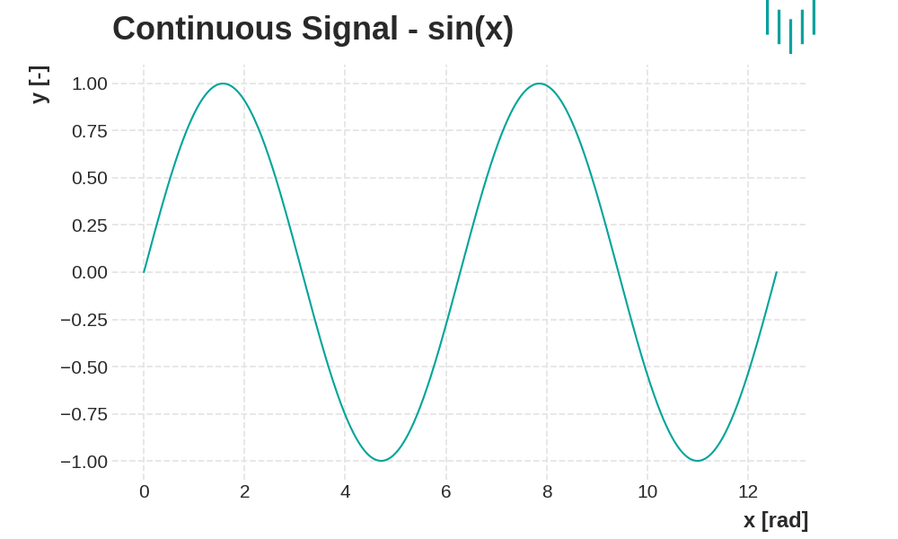
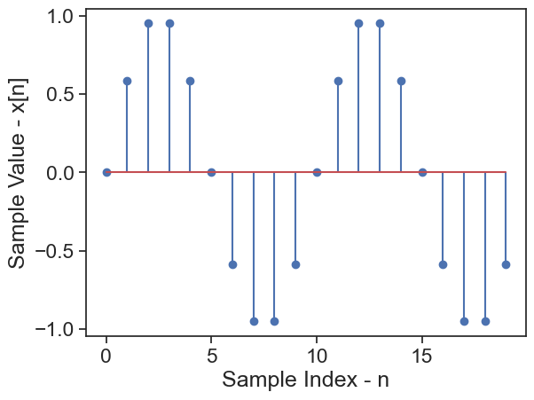
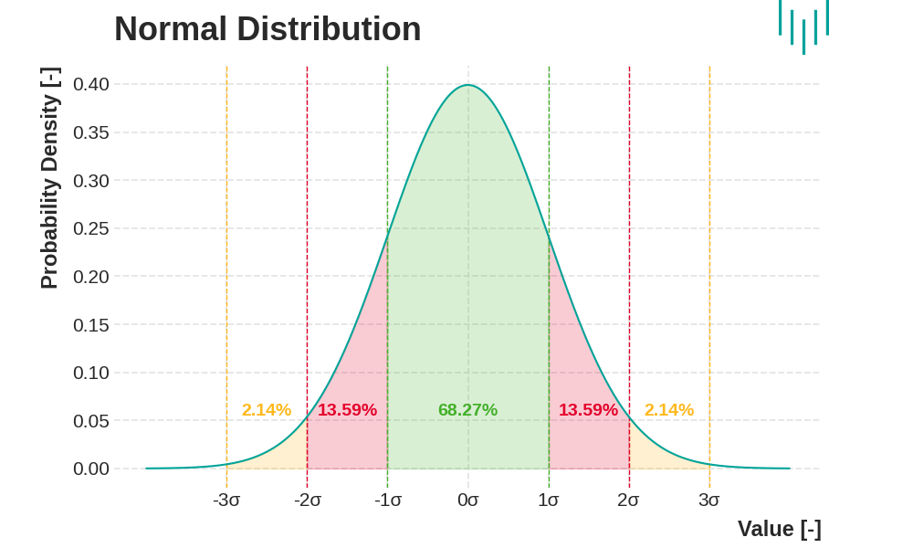
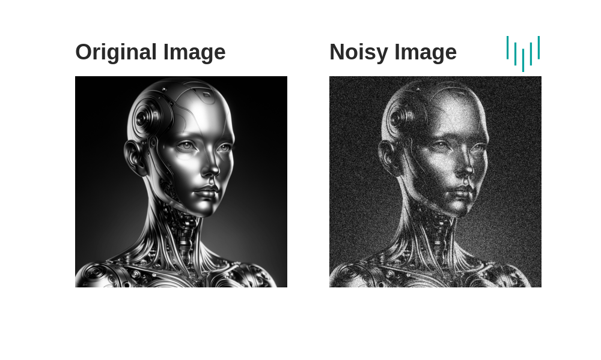

# Exercise 01 – Signals, noise, and channel capacity

This exercise establishes the vocabulary used throughout the course. It introduces the signal as the carrier of information, the conversion of an analog signal into a digital one by pulse-code modulation, Gaussian noise as the basic model of a disturbance, and the Shannon–Hartley formula that bounds the information rate of a noisy channel. In the practical part, students model a harmonic signal corrupted by noise, compute its signal-to-noise ratio and channel capacity, explore the Shannon–Hartley theorem for common access technologies, watch a telegraph signal degrade on a band-limited and noisy channel, and apply noise to real audio and image data.

## Learning objectives

- Classify signals as analog or digital, continuous-time or discrete-time, periodic or aperiodic, deterministic or random.
- Describe the three steps of pulse-code modulation and state the sampling theorem.
- Characterize Gaussian noise by its probability density function and standard deviation.
- Compute signal power, signal-to-noise ratio, and channel capacity from a sampled signal.
- Relate the bandwidth and signal-to-noise ratio of common access technologies to their achievable data rates.
- Explain why the symbol rate of a binary signal is limited by the channel bandwidth and how noise turns a reduced decision margin into bit errors.

## Knowledge prerequisites

Students should be able to:

- Interpret a sine-wave graph and evaluate expressions containing powers, square roots, logarithms, and sums.
- Calculate an arithmetic mean and convert between seconds and milliseconds, and between bits and bytes.
- Define a Python function and use NumPy arrays for element-wise arithmetic and simple plots.

Signal classification, sampling, Gaussian noise, symbol rate, and channel capacity are introduced in this exercise.

## Theory

### Signal

A signal is a physical quantity that varies in time (or space) and carries information. In telecommunications it is typically a voltage, a current, or an electromagnetic wave; in information theory it is the sequence of channel states that encodes a message. A communication system consists of a *transmitter* that encodes a message into a signal, a *channel* that carries it, and a *receiver* that decodes it. In telephony, for example, the microphone converts speech into an electrical signal, the network transports it, and the earpiece converts it back into sound.

Signals are classified along several independent axes:

| Criterion | Classes | Example |
|---|---|---|
| Amplitude | *Analog* – any value in a continuous range; *digital* – a finite set of values, usually binary codes | microphone output; computer data |
| Time | *Continuous-time* – defined at every instant; *discrete-time* – defined only at sampling instants | voltage on a wire; samples in a WAV file |
| Repetition | *Periodic* – repeats with period $T$; *aperiodic* – does not repeat | sine wave; single pulse |
| Predictability | *Deterministic* – described exactly by a function; *random* – described only statistically | $\sin(2\pi f t)$; thermal noise |





Two quantities describe a periodic signal: the period $T$ [s], the duration of one repetition, and the frequency $f = 1/T$ [Hz], the number of repetitions per second.

### Pulse-code modulation

Pulse-code modulation (PCM) converts an analog signal into a digital one in three steps.

1. **Sampling.** The continuous signal is read at regular instants spaced by the sampling period $T_s$, or equivalently at the sampling frequency $f_s = 1/T_s$. The result is a sequence of samples that are discrete in time but can still take any amplitude value.
2. **Quantization.** Each sample is rounded to the nearest of a finite set of levels. The result is a sequence of samples with a finite number of values, each representable by a binary code. The rounding error is called *quantization noise*.
3. **Encoding.** Each quantization level is assigned a binary code word. With $b$ bits per sample, up to $2^b$ levels can be represented.

These steps are illustrated in the [MIT lecture on PCM](https://ocw.mit.edu/courses/16-36-communication-systems-engineering-spring-2009/d91cdcc10683c573cc668c5b1ab3aab6_MIT16_36s09_lec04.pdf). G.711 uses A-law or μ-law *companding*: nonuniform quantization gives finer amplitude resolution to weaker signals. This is distinct from additional audio compression.

For an ideally band-limited signal, exact reconstruction from its samples is possible when the sampling frequency is greater than twice the highest signal frequency:

$$
f_s > 2 f_{\max}
$$

where $f_s$ is the sampling frequency [Hz] and $f_{\max}$ the highest frequency present in the signal [Hz]. If the condition is violated, components above $f_s/2$ are folded back into the lower band; this distortion is called *aliasing*.

> [!NOTE]
> Telephone speech is band-limited to 300–3400 Hz and sampled at $f_s = 8$ kHz with 8-bit quantization, giving the 64 kbit/s PCM stream of the G.711 codec. This stream is the payload of the RTP packets examined in Exercise 03.

### Gaussian noise

Noise is an unwanted random signal added to the useful one. The most common model is *Gaussian noise*, whose amplitude at any instant is a random variable with the normal distribution

$$
p(x) = \frac{1}{\sigma \sqrt{2\pi}} \, e^{-\frac{(x - \mu)^2}{2\sigma^2}}
$$

where $x$ is the noise amplitude, $\mu$ its mean (assumed to be zero in this exercise), and $\sigma$ its standard deviation, the square root of the variance $\sigma^2$. The standard deviation measures how far the noise typically departs from its mean and therefore how strong it is; for zero-mean noise the mean power equals the variance, $N = \sigma^2$.





White noise has a flat power spectral density over the modeled frequency band. In the simulation, it is represented by independent Gaussian samples. Additive white Gaussian noise (AWGN) is the standard channel model used in the next section.

### Signal power and signal-to-noise ratio

For a discrete signal of $n$ samples $x_1, \dots, x_n$ the mean power is

$$
P = \frac{1}{n} \sum_{i=1}^{n} x_i^2
$$

where $P$ is the power [W] when $x_i$ are voltages across a 1 Ω load; the same expression serves as a relative measure otherwise. The signal-to-noise ratio (SNR) is the ratio of signal power to noise power,

$$
\mathrm{SNR} = \frac{S}{N}
$$

where $S$ is the signal power [W] and $N$ the noise power [W]; the ratio itself is dimensionless [–].

SNR is commonly expressed in decibels:

$$
\mathrm{SNR}_{\mathrm{dB}} = 10 \log_{10}(S/N), \qquad S/N = 10^{\mathrm{SNR}_{\mathrm{dB}}/10}
$$

where $\mathrm{SNR}_{\mathrm{dB}}$ is the signal-to-noise ratio [dB] and $S/N$ is the linear ratio [–]. For example, a linear ratio of 100 corresponds to 20 dB. Convert decibels to a linear ratio before using the channel-capacity formula.

### Symbol rate and bandwidth

A digital transmitter sends a sequence of *symbols*, each lasting the symbol interval $T_s$; the symbol rate $R_s = 1/T_s$ is measured in baud [Bd]. A binary telegraph uses two symbols (key up, key down) and therefore carries one bit per symbol. Nyquist showed that an ideal low-pass channel of bandwidth $B$ can carry at most

$$
R_s \le 2B
$$

where $R_s$ is the symbol rate [Bd] and $B$ the channel bandwidth [Hz]. The critical pattern is the alternating sequence 0101…, whose fundamental frequency is $R_s/2$: as soon as it exceeds $B$, the filter removes it and the receiver sees a constant level. Other patterns survive somewhat longer, but every pattern is smeared by the band limitation, and the received value inside one symbol interval then depends on its neighbors; this is *intersymbol interference* (ISI). With $L$ distinguishable amplitude levels per symbol the noiseless bit rate is at most $2B \log_2 L$, but noise limits $L$, which is where the Shannon–Hartley theorem takes over.

A real telegraph line does not cut off sharply. A long cable behaves as a first-order RC low-pass whose step response rises exponentially, so the edges of the pulses are rounded rather than ringing. Its limit on the symbol rate is gradual: the pulses keep shrinking toward the decision threshold until noise tips the decisions over.

### Channel capacity

The Shannon–Hartley theorem gives the highest rate at which information can be transmitted over an AWGN channel with an arbitrarily small error probability:

$$
C = B \log_2 \left( 1 + \frac{S}{N} \right)
$$

where $C$ is the channel capacity [bit/s], $B$ the channel bandwidth [Hz], and $S/N$ the linear signal-to-noise ratio [–]. At fixed SNR, doubling the bandwidth doubles the capacity. Increasing SNR produces diminishing gains because it appears inside a logarithm; doubling SNR adds approximately 1 bit/s/Hz only at high SNR. If bandwidth changes, the noise power may also change, so the fixed-SNR assumption must be checked.

For example, a channel with $B = 3000$ Hz and $S/N = 15$ has $C = 3000 \log_2(16) = 12\,000$ bit/s. Here, bandwidth describes a frequency interval [Hz], while capacity describes an information rate [bit/s]. Application throughput can be lower because practical coding and protocol overhead consume resources.

The table provides illustrative inputs for capacity calculations, rather than specifications or guaranteed performance of the named technologies. Actual bandwidths and SNR depend on the system configuration and operating conditions. Calculate each listed channel separately.

| Technology | Bandwidth $B$ | Carrier | SNR [–] | Note |
|---|---|---|---|---|
| Telephone channel | 3.1 kHz | 300–3400 Hz | 1585 | |
| ADSL | 4.3125 kHz per channel | up to 1.1 MHz | 1000 | 256 parallel channels |
| VDSL | 30 / 35 MHz | up to 35 MHz | 1000 | |
| Wi-Fi 802.11n | 20 / 40 MHz | 2.4 / 5 GHz | 316 / 631 | |
| 5G | 100 MHz | 2.3 GHz | 32 / 100 | |
| 5G mmWave | 500 / 1000 / 2000 MHz | 28 / 38 / 72 GHz | 6.3 | |

As an extension, consider multiple-input multiple-output (MIMO) systems, which use several antennas at both ends. Multiple spatial streams can share the same frequency band when the propagation conditions allow the receiver to distinguish them. The antenna count alone does not guarantee that many independent streams.

## Exercise

### Preparation

Create the environment and start JupyterLab as described in the [root README](../README.md), then open `qos_01/exercise_01.ipynb`.

```bash
cd qos-01
uv sync
uv run jupyter lab --ip 0.0.0.0
```

The notebook builds three interactive models from `lib/core.py`, displayed with Bokeh plots and Panel widgets: a `HarmSignal` with adjustable amplitude, frequency, phase, and channel bandwidth added to a `NoiseSignal` with adjustable standard deviation; a `CapacityExplorer` for the Shannon–Hartley theorem with technology presets; and a `Telegraph` that sends a bit sequence over a band-limited, noisy channel.

### Step 1 – Implement the channel metrics

Implement `calc_signal_power` and `calc_channel_capacity` in the notebook using the formulas above, keeping the signatures of the template cell, which the *Calculate* button calls by name. Only after Step 2 compare the result with the reference implementation in `lib/core.py`.

### Step 2 – Model a signal with noise

Run the notebook up to the first dashboard. Predict how each slider will affect SNR and capacity, then vary one parameter at a time and press *Calculate*. Verify the displayed values against a manual computation for one setting. Record the parameter values, measured results, and whether they support the prediction. The noise power is measured over the whole sampled band, so the bandwidth slider only supplies $B$ to the formula and the SNR stays fixed while $B$ changes.

### Step 3 – Explore the Shannon–Hartley theorem

The second dashboard plots the capacity as a function of bandwidth at a chosen SNR and the spectral efficiency $C/B$ as a function of SNR, with a technology preset menu filled from the table above. Compare the presets, then compare the gain from doubling the bandwidth with the gain from doubling the SNR, and find the SNR below which the high-SNR approximation $C/B \approx \log_2(S/N)$ stops being useful.

### Step 4 – Send a telegraph signal over a band-limited, noisy channel

The third dashboard sends 32 bits as on–off pulses at a symbol rate $R_s$ through either an ideal low-pass filter or an RC line of bandwidth $B$, adds Gaussian noise, and decides each bit in the middle of its interval. Without noise, raise $R_s$ for each bit pattern until errors appear and compare the result with $2B$ for both channel models. Then fix an error-free setting and raise the noise until the first errors occur; relate the tolerated noise to the decision margin left by the filter.

### Step 5 – Apply noise to audio

Record or generate a short audio signal, preferably speech. Keep the clean signal fixed and add Gaussian white noise at three variances. Record the random seed and compute the SNR for each version. Listen at a consistent, comfortable playback level and describe which speech features become harder to hear.

### Step 6 – Apply noise to an image

From the notebook directory, load `../fig/android_gray.jpeg` as a floating-point grayscale array scaled to $[0, 1]$. Add Gaussian noise at three variances and clip the displayed pixel values to $[0, 1]$. Record the variances and random seed, and save the degraded images for Exercise 04. Clipping changes the resulting error, so distinguish the generated noise from the error remaining in the saved image.

### Results to retain

Save the completed notebook, the audio and image examples, and a table of parameters and calculated metrics. Include one manual capacity calculation, the symbol rates at which the telegraph link failed for each channel model, and a short explanation of differences between predicted, measured, and perceived quality.

## Questions

1. What is the unit in which SNR is commonly expressed, and how does it relate to the linear ratio used in the Shannon–Hartley formula?
2. **Extension:** How can independent spatial streams increase total capacity while sharing the same frequency band? Why is antenna count alone insufficient to predict the gain?
3. Compute the capacity of the analog voiceband telephone channel in the table. The 64 kbit/s PCM stream represents the sampled speech and travels over a digital network connection. Why does comparing these two rates not show a violation of the channel-capacity bound?
4. What happens to a 5 kHz tone sampled at $f_s = 8$ kHz?
5. In the telegraph simulation, why is the alternating pattern 0101… the first to fail when the symbol rate exceeds $2B$, and what does this have in common with the sampling theorem?
6. The telegraph link without noise and with $R_s < 2B$ transmits without errors, yet the Shannon–Hartley capacity for $N = 0$ is infinite. Which assumption of the simulation, rather than of the theorem, keeps the rate finite?

## References

1. C. E. Shannon, "A Mathematical Theory of Communication," *Bell System Technical Journal*, vol. 27, pp. 379–423, 623–656, 1948.
2. C. E. Shannon, "Communication in the Presence of Noise," *Proceedings of the IRE*, vol. 37, no. 1, pp. 10–21, 1949.
3. H. Nyquist, "Certain Topics in Telegraph Transmission Theory," *Transactions of the AIEE*, vol. 47, pp. 617–644, 1928.
4. J. G. Proakis and M. Salehi, *Digital Communications*, 5th ed. McGraw-Hill, 2008.
5. ITU-T Recommendation G.711, *Pulse code modulation (PCM) of voice frequencies*, 1988.
6. Wikipedia, "Signal," https://en.wikipedia.org/wiki/Signal.
