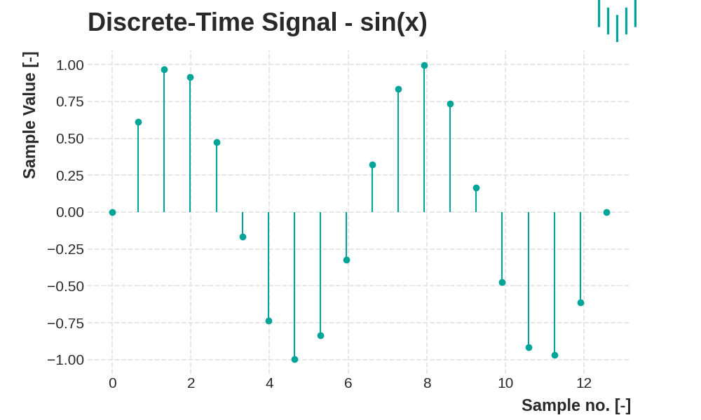

# Exercise 01

## Signal

An excerpt from [Wikipedia](https://en.wikipedia.org/wiki/Signal):

- In [electronics](https://en.wikipedia.org/wiki/Electronics) and [telecommunications](https://en.wikipedia.org/wiki/Telecommunications), *signal* refers to any time-varying [voltage](https://en.wikipedia.org/wiki/Voltage), [current](https://en.wikipedia.org/wiki/Electric_current), or [electromagnetic wave](https://en.wikipedia.org/wiki/Electromagnetic_wave) that carries information.

- In [signal processing](https://en.wikipedia.org/wiki/Signal_processing), signals are analog and digital representations of analog physical quantities.
- In [information theory](https://en.wikipedia.org/wiki/Information_theory), a signal is a codified message, that is, the sequence of [states](https://en.wikipedia.org/wiki/State_variable) in a [communication channel](https://en.wikipedia.org/wiki/Communication_channel) that encodes a message.
- In a communication system, a *transmitter* encodes a *message* to create a signal, which is carried to a *receiver* by the communication channel.  For example, the words "[Mary had a little lamb](https://en.wikipedia.org/wiki/Mary_had_a_little_lamb)" might be the message spoken into a [telephone](https://en.wikipedia.org/wiki/Telephone). The telephone transmitter converts the sounds into an electrical  signal. The signal is transmitted to the receiving telephone by wires;  at the receiver it is reconverted into sounds.
- In telephone networks, [signaling](https://en.wikipedia.org/wiki/Signaling_(telecommunications)), for example [common-channel signaling](https://en.wikipedia.org/wiki/Common-channel_signaling), refers to phone number and other digital control information rather than the actual voice signal.

Signal classification:

1. **Analog vs. Digital Signals**:

   - **Analog Signals**: These are continuous signals that vary over time and can take any value in a given range. Examples include audio signals and traditional television broadcasts.

   - **Digital Signals**: These are discrete signals that have specific values, often represented as binary numbers (0s and 1s). Examples include computer data and digital television.

1. **Periodic vs. Aperiodic Signals**:

   - **Periodic Signals**: These repeat at regular intervals over time. An example is a sine wave.

   - **Aperiodic Signals**: These do not repeat at regular intervals. An example is a single pulse or a random signal.

1. **Deterministic vs. Random Signals**:

   - **Deterministic Signals**: These can be precisely described by mathematical functions. Their behavior is predictable.

   - **Random Signals**: These cannot be precisely described by mathematical functions and are often modeled statistically. Their behavior is not predictable.

1. **Continuous-Time vs. Discrete-Time Signals**:

   - **Continuous-Time Signals**: These are defined for every instant of time.

   - **Discrete-Time Signals**: These are defined only at discrete intervals of time.

   - **Continuous** - A continuous or piecewise continuous function of a continuous independent variable.

      

## PCM (Pulse Coded Modulation)

**Sampling** 

We select a limited number of samples from the continuous analog signal that represents the recorded sound or image. 
The result is a finite number of analog samples that are captured with a period $T_{sr}$ given by the sampling rate.

**Quantization**

This is level discretization (i.e. rounding the actual value to pre-selected values). 
The result of this operation is a finite number of samples (that were already available after sampling) with a finite number of their values, which are expressed by a certain binary code.

**Coding**

Replace the obtained simple binary code with a code that is more suitable for further processing.

> **TIP:** The sampling circuit introduces error in the form of (overlapping) aliasing, the quantization circuit in the form of quantization noise.

**Conditions for correct sampling (Shannon-Kotelnik theorem)**

The sampling theorem applies here, which states that a signal is only describable if it is bounded by a frequency $f_{max}$, and if $f_{sr}$ => 2 * $f_{max}$, i.e. it means that the sampling frequency must be at least twice the highest frequency of the signal.  

Use e.g. for DPS (Digital Signaling Processor) - allows frequency adjustment, volume adjustment, or signal compression. E.g. MP3 - the analogue signal is converted to a digital signal, then to a DSP, which encodes the signal and decodes it back using a DSP (MPEG-1/2 for audio compression).

$T[s]$ (Period) - denotes in physics a physical quantity that indicates the duration of one repetition of a periodic event
$f[Hz = s^{-1}]$ (Frequency or frequency) - indicates the number of periods per unit time

## Gaussian noise

Gaussian noise represents random changes in intensity corresponding to a Gaussian (normal) distribution.

$$
P(x) = \frac{1}{\sigma \sqrt{2\pi}}e^{-\frac{(x - \mu )^2}{2\sigma ^2}}
$$
The standard deviation ($\sigma$) is a measure of statistical variability often used in probability theory and statistics. 
It is the square root of the variance of a random variable. The sampling standard deviation is a characteristic of the variability (variability) of a statistical population.

## Channel capacity (Shannon's formula)

$$
C = B \cdot log_2 \left( 1+\frac{S}{N} \right)
$$

where:

- **C:** channel capacity (bps)
- **B:** channel bandwidth (Hz)
- **S:** signal power (W)

- **N:** noise power (W)

- **S/N:** signal to noise ratio (-)

### Technologies

The technologies are listed here, with frequency, bandwidth and SNR information:

- **Telephone channel**
    - BW = 3100 Hz  (300 - 3400 Hz)
    - SNR = 1584.89
- **ADSL**
    - BW = 4.3125 kHz
    - SNR = 1000 *(256 channels - Technology uses multiple channels simultaneously)*
- **VDSL**
    - BW = 30/35 MHz
    - SNR = 1000
- **WiFi 802.11n**
    - BW = 20 MHz (2.4 GHz) / 40 MHz (5 GHz)
    - SNR = 316.227 / 630.957
- **5G**
    - BW = 100 MHz (2300 MHz)
    - SNR = 31.62  / 100.00
- **5G mmWave**
    - BW = 500/1000/2000 MHz (28/38/72 GHz)
    - SNR = 6.3

*[xDSL frequencies](https://vi.wikipedia.org/wiki/VDSL#/media/T%E1%BA%ADp_tin:VDSL2_frequencies.png).*

**MIMO:** 2x2, 4x4, 8x8, 16x16, 32x32, and 64x64 (Antennas)
The numbers refer to the number of streams the router is working with. The router in the 2x2 variant has two antennas that are used for 2 simultaneous streams. 

