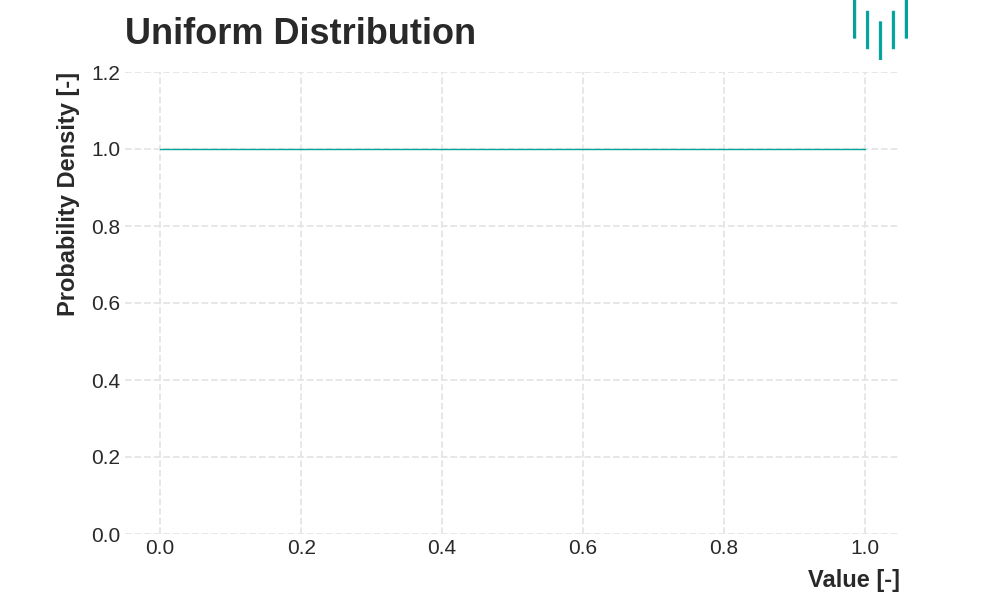
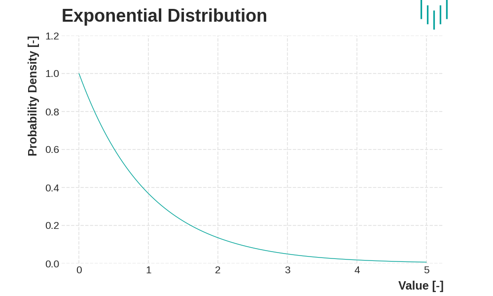

# Exercise 02

### History of Probability Theory

Probability theory originated from the study of games of chance in the 16th and 17th centuries. Early mathematicians, intrigued by gambling, began to formalize the rules of probability. This work laid the foundation for understanding how likely events are to occur. Over time, probability theory expanded beyond gambling to include a wide range of applications in science, economics, and everyday decision-making.

In the 18th and 19th centuries, probability theory was further developed with key concepts like the Law of Large Numbers, which explains how the average of many trials converges to the expected value. By the 20th century, probability had become a rigorous mathematical discipline, thanks to the work of mathematicians who established its formal axioms and principles.

### Random Variables

A random variable is a fundamental concept in probability, representing a numerical outcome of a random process. It allows us to quantify uncertainty and make predictions about future events. There are two main types of random variables:

1. **Discrete Random Variables**: These have a finite or countable number of possible outcomes. For example, the result of rolling a six-sided die is a discrete random variable, as it can only result in one of six specific numbers.
2. **Continuous Random Variables**: These can take on any value within a given range. An example is the exact height of individuals in a population, which can vary continuously and is not limited to specific values.

### Key Concepts

- **Probability Distribution**: This describes how probabilities are assigned to the possible values of a random variable. For discrete random variables, this is often represented by a probability mass function (PMF), which lists the probabilities of each possible outcome. For continuous random variables, a probability density function (PDF) is used, which describes the likelihood of the variable taking on a particular value within a range.
- **Expectation**: Also known as the expected value, this is a measure of the central tendency of a random variable. It is akin to an average and provides a single summary value that represents the typical outcome of the random process.
- **Variance**: This measures the spread or dispersion of the values of a random variable. A high variance indicates that the values are spread out over a wide range, while a low variance indicates that they are clustered closely around the expected value.

These concepts are essential for understanding and modeling uncertainty in various fields, from predicting stock market trends to assessing risks in engineering projects. They provide the tools needed to analyze random processes and make informed decisions based on probabilistic reasoning.

### Statistical distributions

#### Uniform distribution

The uniform distribution is one of the simplest probability distributions. It assigns the same probability to all values of a continuous random variable X within a specified interval of finite length. This means that every outcome within this interval is equally likely to occur.

For example, the uniform distribution can model scenarios where all outcomes have the same likelihood, such as the waiting time for a bus or the time it takes for a product to be processed on an automatic production line.

#### Exponential distribution

The exponential distribution is associated with a continuous random variable X, which represents the waiting time until the occurrence of a Poisson random event, or the length of the interval (in time or distance) between two such events. Examples include the waiting time for an operator or the distance between two damaged locations on a road.

This distribution models the time between randomly occurring events that follow a Poisson distribution. It is characterized by the parameter λ, which is the inverse of the mean waiting time until the occurrence of the event being monitored.

#### Normal distribution

The normal distribution is one of the most important continuous distributions in probability theory and statistics. It often serves as an approximation for a wide range of random variables—variables whose values are determined by the outcomes of random experiments.

For example, the normal distribution can describe the distribution of random errors in various activities, such as deviations in dimensions from a predetermined standard during the manufacturing of components. It also applies to many measurable characteristics in biological statistics, including traits in livestock, experimental cell cultures, and humans.

Specifically, normal distributions are commonly observed in characteristics such as weight, IQ, and height.

### Poisson process

The most used input flow model. We use the Poisson flow model always when customers (incoming calls, data packets, ...) come from a large set of mutually independent users.

**Example:**

On an hourly on average, 15 customers come to the payphone. Each call takes an average of 3 minutes. Is it necessary to buy another payphone if we don't want customers to wait longer than 3 minutes? The arrival of customers follows a Poisson process, the time to make a call is random and follows an exponential distribution.

### Basics of Queuing Systems

A Queuing System is a framework used to manage and service incoming requests, often referred to as customers. These systems can consist of one or more parallel lines, also known as channels, that handle these requests.

The fundamental components of queuing systems include:

**1. Requests** (customers, packets, requests, tickets...)

**2. Service Channels** (service lines)

In a Queuing System, requests (customers) arrive at a service point, which may consist of one or more parallel service lines. Each system has a finite number of service lines, which determines its service capacity—the maximum number of requests that can be handled simultaneously. If a service line is available, the request is accepted and service begins immediately. System can contain memory/queue (e.g. router) or be memoryless (e.g. PBX).

#### Classification of Queuing Systems:

- **Input Flow**: Describes how requests originate and arrive at the system.
- **Service Lines**: Details the number of service lines and the nature of the service process.
- **Queuing Mode**: Explains how requests are managed when they cannot be served immediately.

The most widely used classification method is the Kendall notation, which succinctly describes the type of Queuing System based on its key characteristics.

**A/B/n Notation:**

- **A**: Type of process describing request arrivals.
- **B**: Type of service time distribution.
- **n**: Number of service lines.

#### Basic Model - M/M/1 Type:

This is the simplest form of a queuing model, characterized by:

- A single service channel.
- Exponential distribution for both the intervals between request arrivals and service times.
- Unlimited queue size and incoming requests, with all requests waiting patiently in a First-In-First-Out (FIFO) manner, even if the service capacity is exceeded.

In this notation, "M" stands for Markovian, indicating that the system has a Poisson arrival process, an exponential service time distribution, and one server.

### Little's formula and system occupancy

Theory According to **Little's Law**, the average number of requests in a system is equal to the arrival rate multiplied by the average time a request spends in the system.

**Formula:**

$$ L = \lambda W $$

Where:

- $L$ — Average number of requests in the **system**
- $\lambda$ — Average arrival rate of requests
- $W$ — Mean delay (average time a request spends in the **system**)

Similarly, for the queue:

$$ L_q = \lambda W_q $$

- $L_q$ — Average number of requests in the **queue**
- $W_q$ — Average time a request spends **waiting in the queue**

The **mean delay** can also be expressed as:

$$ W = \dfrac{L}{\lambda} $$

Offered Traffic $A$:

$$ A = \lambda S = \frac{\lambda}{\mu} $$

- $A$ — Offered traffic or traffic intensity.
- $\lambda$ — Average arrival rate of requests (i.e. 2 req/hour).
- $S = 1/\mu$ — Average service time (i.e. 3 hours).
- $\mu$ — Average service rate (i.e. 1/3 req/hour).

System Utilization $\rho$ (the proportion of time the server is busy):

$$ \rho = \frac{\lambda}{\mu} = A $$

> [!IMPORTANT]  
> This works for M/M/1 system. In case of an **M/M/k** system, more general formula must be used: $\rho = A/k$

Average Number of Requests in the System $L$ For an **M/M/1** queue:

$$ L = \frac{\rho}{1 - \rho} $$

Average Number of Requests in the Queue $L_q$:

$$ L_q = L - \rho = \frac{\rho^2}{1 - \rho} $$

Average Delay in the System $W$:

$$ W = \frac{1}{\mu - \lambda} $$

Average Delay in the Queue $W_q$ :

$$ W_q = W - \frac{1}{\mu} = \frac{\rho}{\mu - \lambda} $$
