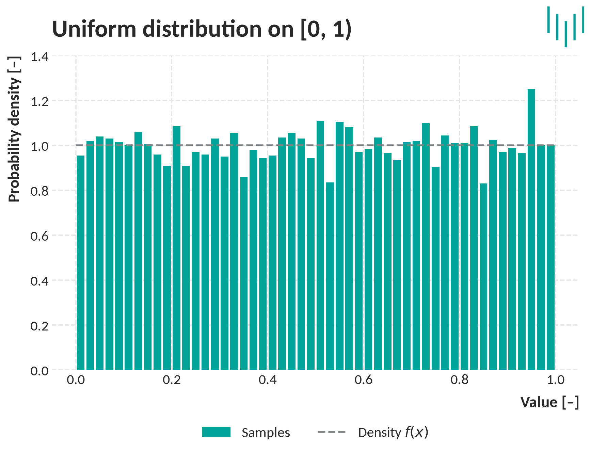
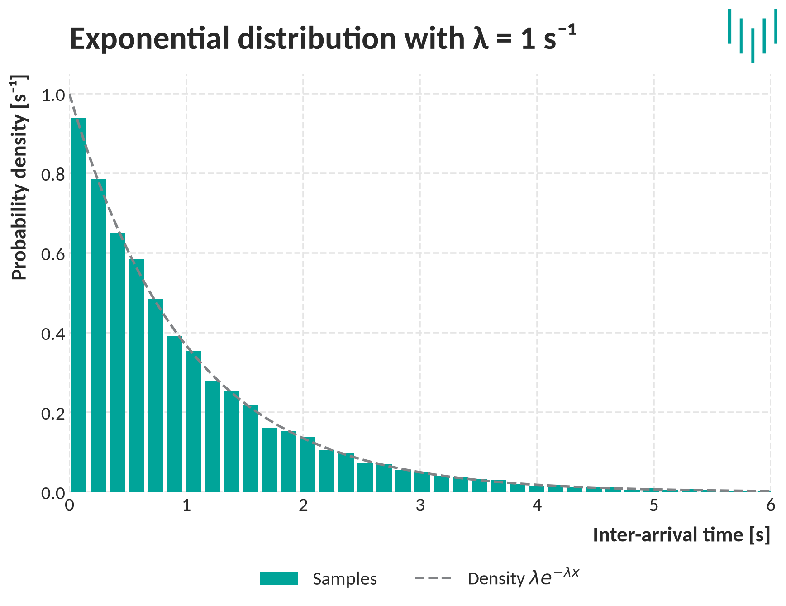
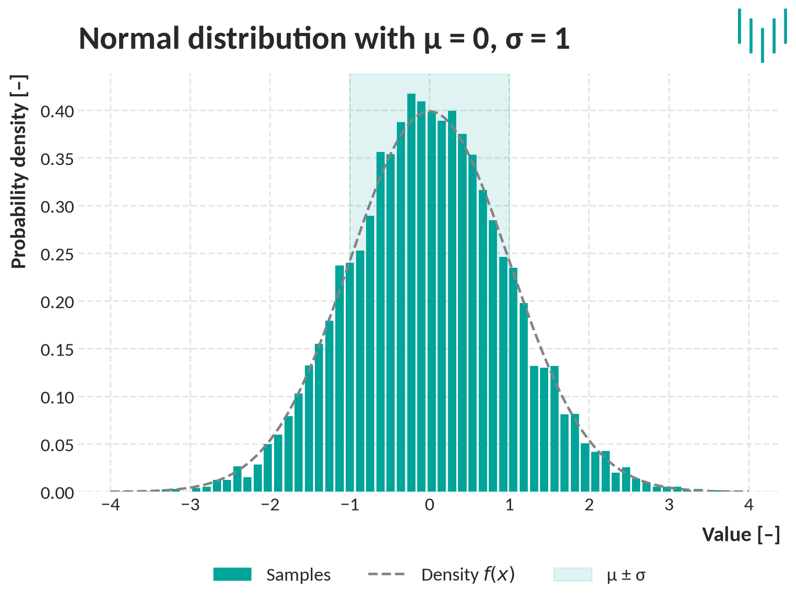
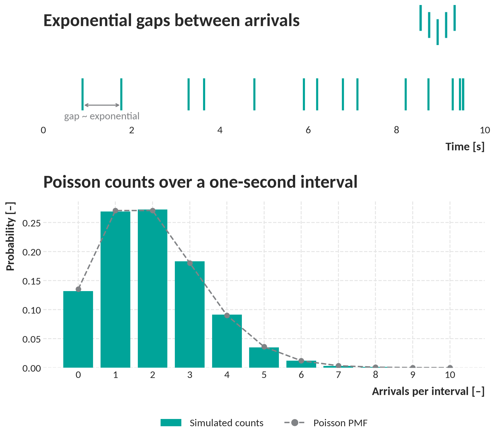
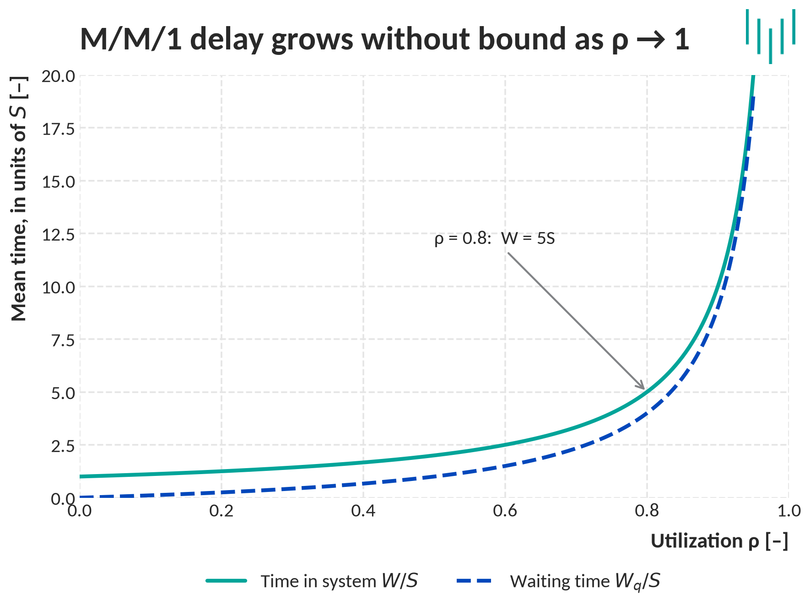
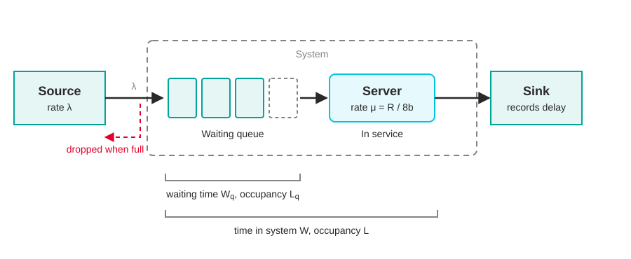

# Exercise 02 – Random variables, the Poisson process, and queueing systems

This exercise introduces the probabilistic tools used to describe network traffic. It reviews random variables and the uniform, exponential, and normal distributions, introduces the Poisson process as a baseline model of independent arrivals, and presents the M/M/1 queue together with Little's law. In the practical part, students generate random samples, build a discrete-event simulation of packet sources, a switch, and sinks in SimPy, and compare the measured delay and occupancy of a simulated M/M/1 system with the analytical formulas.

## Learning objectives

- Distinguish discrete and continuous random variables and read a probability mass or density function.
- Generate samples from the uniform, exponential, and normal distributions and interpret their histograms.
- State the assumptions of the Poisson arrival model and relate it to exponential inter-arrival times.
- Read Kendall notation and state the assumptions of the M/M/1 model.
- Compute offered traffic, utilization, mean occupancy, and mean delay of an M/M/1 system and verify them by simulation.
- Explain why the mean delay of a queue grows without bound as utilization approaches one, and demonstrate it by sweeping the arrival rate.
- Distinguish the mean of a delay distribution from its tail, and say why the tail is what a quality requirement constrains.

## Knowledge prerequisites

Students should be able to:

- Calculate an arithmetic mean, interpret a graph, and recall Gaussian noise and standard deviation from [Exercise 01](../qos-01/README.md).
- Convert packet sizes from bytes to bits and calculate a transmission time from a packet size and a bit rate.
- Write Python functions, pass arguments to them, and access an object's attributes and methods.

Random variables and probability distributions are reviewed below. The Poisson process, queueing models, and simulation with SimPy are introduced in this exercise.

## Theory

### Random variables

A *random variable* assigns a number to the outcome of a random experiment. It is *discrete* when it takes finitely or countably many values (the number of packets arriving in one second) and *continuous* when it takes any value in an interval (the time between two arrivals).

The behavior of a random variable $X$ is described by its *probability distribution*: a probability mass function (PMF) $P(X = k)$ for discrete variables, or a probability density function (PDF) $f(x)$ for continuous ones, where the probability of $X$ falling into an interval is the area under $f$ over that interval. Two numbers summarize a distribution:

- the *expectation* (mean) $E[X]$, the value around which outcomes are centered, and
- the *variance* $\operatorname{Var}[X] = E\big[(X - E[X])^2\big]$, the spread of outcomes around the mean; its square root is the standard deviation $\sigma$.

### Uniform distribution

The continuous uniform distribution on the interval $[a, b]$ assigns equal density to every value in the interval:

$$
f(x) = \frac{1}{b - a}, \qquad a \leq x \leq b
$$

where $a$ and $b$ are the interval bounds; the mean is $(a + b)/2$. Pseudo-random generators produce uniform samples on $[0, 1)$, from which samples of every other distribution are derived.



### Exponential distribution

The exponential distribution describes the waiting time until the next event of a Poisson process, or equivalently the interval between two consecutive events:

$$
f(x) = \lambda e^{-\lambda x}, \qquad x \geq 0
$$

where $\lambda$ is the event rate [s⁻¹] and $1/\lambda$ the mean waiting time [s]. The distribution is *memoryless*: the time still to wait does not depend on how long one has already waited. This property is what makes the queueing models below tractable.



### Normal distribution

The normal distribution, introduced in [Exercise 01](../qos-01/README.md#gaussian-noise), can approximate quantities arising from many small independent effects, such as measurement errors and channel noise. It is described by its mean $\mu$ and standard deviation $\sigma$. It is useful for comparing distribution shapes, but permits negative values and therefore cannot directly model inter-arrival times. The simulation below uses positive uniform intervals as a contrasting model that is not memoryless.



### Poisson process

A homogeneous Poisson process is a baseline model of arrivals at a constant average rate $\lambda$. Counts in disjoint time intervals are independent, and the distribution of a count depends only on the interval length. These assumptions can approximate some aggregated traffic, but do not describe every packet stream: periodic transmissions and correlated bursts violate them. The process has two equivalent descriptions. First, the number of arrivals $N$ in an interval of length $t$ has the Poisson distribution

$$
P(N = k) = \frac{(\lambda t)^k}{k!} \, e^{-\lambda t}, \qquad k = 0, 1, 2, \dots
$$

where $\lambda$ is the arrival rate [s⁻¹] and $t$ the interval length [s]; the mean number of arrivals is $\lambda t$. Second, the intervals between consecutive arrivals are independent and exponentially distributed with rate $\lambda$.

The second description is the one used in simulation: a source that draws each inter-arrival time from an exponential distribution generates a Poisson process. The figure below shows both descriptions of the same run: exponential gaps on a timeline above, and the resulting counts per one-second interval against the Poisson probability mass function below.



### Queueing systems

A *queueing system* serves incoming *requests* (customers, calls, packets) using one or more *service channels* (servers, lines). The number of servers determines how many requests can be served simultaneously. The buffer capacity limits waiting requests, whereas total system capacity includes requests in service. In the simulation, buffer capacity is specified in bytes. A request that finds a free channel is served immediately; otherwise it either waits in a *queue* (a router buffer) or is rejected (a PBX without call waiting). A system is characterized by

- the input flow – how requests arrive,
- the service – the number of channels and the distribution of service times, and
- the queueing discipline – how waiting requests are managed (queue length, service order).

*Kendall notation* $A/B/n$ summarizes these: $A$ is the arrival process, $B$ the service-time distribution, and $n$ the number of channels. The symbol M (*Markovian*) denotes a Poisson process for $A$ and an exponential distribution for $B$; D denotes deterministic times and G a general distribution.

### The M/M/1 system

M/M/1 is the simplest queueing model: Poisson arrivals with rate $\lambda$, exponentially distributed service times with rate $\mu$ (mean service time $S = 1/\mu$), one channel, an unbounded queue, and first-in-first-out service. A constant-rate switch port with Poisson arrivals and exponentially distributed packet sizes approximates this model when its buffer is large enough that loss is negligible. A finite buffer and the rounding of packet sizes in the simulation make the correspondence approximate.

The *offered traffic* (traffic intensity) is

$$
A = \lambda S = \frac{\lambda}{\mu}
$$

where $A$ is the offered traffic [erl], $\lambda$ the arrival rate [s⁻¹], $S$ the mean service time [s], and $\mu$ the service rate [s⁻¹]. For a stable single-server system without losses, the *utilization* $\rho$, the fraction of time the server is busy, equals the offered traffic:

$$
\rho = \frac{\lambda}{\mu} = A
$$

The infinite-buffer model has a steady state only for $\rho < 1$. At or above this threshold there is no finite steady-state mean queue length. In a finite-buffer simulation, excess traffic is dropped instead of accumulating indefinitely.

> [!IMPORTANT]
> With $k$ channels (M/M/k) the utilization is $\rho = A/k$; the remaining formulas of this section hold for M/M/1 only.

For a stable M/M/1 system the mean number of requests in the system $L$ and in the queue $L_q$ are

$$
L = \frac{\rho}{1 - \rho}, \qquad L_q = L - \rho = \frac{\rho^2}{1 - \rho}
$$

and the mean time a request spends in the system $W$ and in the queue $W_q$ are

$$
W = \frac{1}{\mu - \lambda}, \qquad W_q = W - \frac{1}{\mu} = \frac{\rho}{\mu - \lambda}
$$

where $L$ and $L_q$ are dimensionless [–] and $W$ and $W_q$ are times [s]. All four quantities grow without bound as $\rho \to 1$, which is why links are operated well below full utilization. Dividing the delays by the mean service time $S$ removes the dependence on the link rate, so the curves below hold for every M/M/1 system: at $\rho = 0.8$ a packet already spends five service times in the system, four of them waiting.



### Worked example: from packet size to delay

Consider Poisson arrivals at $\lambda = 5$ packets/s, exponential packet sizes with mean $\bar{b} = 100$ B, and a link rate $R = 8000$ bit/s. The mean service time is

$$
S = \frac{8\bar{b}}{R} = \frac{8 \cdot 100}{8000} = 0.1 \; \mathrm{s}
$$

where $S$ is mean service time [s], $\bar{b}$ is mean packet size [B], and $R$ is link rate [bit/s]. Thus $\mu = 10$ packets/s and $\rho = 0.5$. For the ideal M/M/1 model, $L = 1$, $W = 0.2$ s, and $W_q = 0.1$ s. The packet spends 0.1 s waiting and 0.1 s being transmitted, on average.



The queue occupancy $L_q$ excludes the packet being transmitted; system occupancy $L$ includes it. In the diagram $R$ is the link rate [bit/s] and $b$ the mean packet size [B], so $\mu = R / 8b$ packets per second.

### Little's law

Little's law relates occupancy and delay for *any* stable queueing system, regardless of the arrival and service distributions:

$$
L = \lambda W, \qquad L_q = \lambda W_q
$$

where $L$ is the mean number of requests in the system [–], $\lambda$ the rate of requests admitted to that system [s⁻¹], and $W$ their mean time in the system [s]; the second form applies to the queue alone. If requests are rejected, use the admitted rate rather than the offered rate. The law allows one of the three quantities to be obtained from measurements of the other two; in the simulation, the mean occupancy reported by a network tap and the mean delay reported by a sink should satisfy it.

## Exercise

### Preparation

Create the environment and start JupyterLab as described in the [root README](../README.md), then open `qos_02/exercise_02.ipynb`.

```bash
cd qos-02
uv sync
uv run jupyter lab --ip 0.0.0.0
```

The simulation uses [SimPy](https://simpy.readthedocs.io/) to advance from one event to the next. One simulation time unit (STU) represents one second in this exercise. The components in `lib/core.py` have the following roles:

| Component | Role |
|---|---|
| `PacketSource` | Generates packets with given sizes and inter-arrival times |
| `SwitchPort` | Buffers waiting packets and transmits one packet at a fixed bit rate |
| `Switch` | Groups several ports |
| `PacketSink` | Records the elapsed time from packet creation to reception |
| `NetworkTap` | Samples the occupancy of one port at a regular interval |
| `PacketFork` | Sends each packet to one of several destinations with given probabilities |

The tables and cards that display the results live in `lib/report.py`. Every card states three things: the quantity with its unit, the value, and a note saying what the number counts and which attribute it was read from, so a figure on screen can be traced back to the simulation that produced it. `mm1_measurements` there extracts the seven M/M/1 quantities from a finished run, keyed exactly like the `theory` dictionary of Task 3, so that a theoretical value and the measurement meant to confirm it are always matched by name.

Components are connected by assigning `destination`, either in the constructor or afterwards. Sizes and intervals may be numbers or zero-argument functions; `partial(rng.exponential, 2)` returns a function that draws an exponential interval with mean 2 s on each call.

Throughout the simulation the *queue* is what waits in the buffer, and the *system* is the queue plus the packet being transmitted. The attribute names follow that split, because the two are compared against different formulas:

| Quantity | Where to read it | Formula |
|---|---|---|
| Packets waiting | `port.queue_packets`, `tap.queue_packets` | $L_q$ |
| Packets in the system | `port.packets_in_system`, `tap.system_packets` | $L$ |
| Bytes waiting | `port.queue_bytes`, `tap.queue_bytes` | – |
| Time from creation to reception | `sink.delays` | $W$ |
| Packets dropped for lack of buffer | `port.cum_drop_count` | – |

> [!IMPORTANT]
> Every simulation cell in the notebook starts by recreating the generator from `SEED` and resetting the packet counter, so a cell gives the same result each time it is run. Re-running a cell without that reset continues the generator and changes the numbers.

> [!NOTE]
> A `PacketFork` creates its own unseeded generator unless one is passed as `rng`. Pass the notebook's seeded generator whenever a run with a fork must be reproducible.

### Step 0 – Generate random samples

Run the notebook's theory cells to draw 10 000 samples from each distribution and plot normalized histograms against the theoretical density. Record the seed, the parameters, and the sample mean and standard deviation printed by each cell. A finite-sample minimum or maximum is not a distribution boundary for an unbounded distribution. The last theory cell counts arrivals generated from exponential gaps and compares the counts with the Poisson probability mass function, demonstrating the equivalence stated above.

The following step numbers match the notebook.

### Step 1 – Source and sink

Run one `PacketSource` connected directly to a `PacketSink`. In **Task 1**, extend this to two sources with different sizes and intervals, then replace the constants by distributions using `partial`. Compare the timing in the sink log with the source settings.

### Step 2 – Source, switch, and sink

Insert a `Switch` between source and sink. Use uniform intervals from 1 to 3 s, exponential packet sizes with mean 50 B, a 100 B buffer, and a rate of 1000 bit/s.

In **Task 2**, record the drop counter and explain why the measured mean time in system falls *below* the $8 \cdot 50 / 1000 = 0.4$ s that a packet of the mean size needs. A buffer of 100 B cannot admit a packet larger than 100 B even when it is empty, so the packets that reach the sink are smaller on average than the packets the source generated. Then reduce the rate or the buffer capacity and explain the effect on both delay and loss.

### Step 3 – Network tap

Attach a `NetworkTap` to the port of Step 2. Because the cell reseeds the generator, this is the same realization as Step 2, so the tap samples and the sink delays describe the same packets. Check that `tap.system_packets` exceeds `tap.queue_packets` exactly when a packet is in service, and decide which of the two belongs in a formula for $L$ and which in a formula for $L_q$.

### Step 4 – M/M/1 approximation

Use exponential intervals with mean 2 s, exponential packet sizes with mean 100 B, one port at 1000 bit/s, and a 10 000 B buffer. Run for 8000 s and exclude the first 1000 s as a warm-up period, during which an initially empty system approaches typical operating conditions.

Before any averaging, `queue_view` plays the run back one instant at a time: the waiting packets in the buffer labelled with their sizes, the packet in the server with the fraction of it already sent, and the two occupancy counters the tap records. Watching a packet leave the buffer and enter the server shows $L_q$ fall by one while $L$ holds, which is the whole difference between the two formulas. The view reconstructs each packet's history from the sink log alone — for one port feeding a sink, transmission takes $8b/R$ seconds and ends on arrival — so the simulation records nothing extra. Because the server is idle most of the time at $\rho = 0.4$, it selects the busiest 60 s rather than an arbitrary stretch; the run as a whole is quieter than the window shown. The notebook plots the occupancy against time with a running mean, so the transient can be seen rather than assumed, and the distribution of the measured delay with its mean and 95th percentile marked.

**Task 3** is the comparison with theory. Fill the seven theoretical values into a single dictionary:

```python
theory = {"lambda": ..., "mu": ..., "rho": ..., "L": ..., "L_q": ..., "W": ..., "W_q": ...}
```

`mm1_report` then prints one row per symbol, and that row carries everything needed to judge it: the formula the theoretical value follows from, the value itself, the measurement that should confirm it, where in the simulation that measurement was taken, and whether the two agree. Because theory and measurement are matched by dictionary key, no value can be compared against the wrong row.

| Column | What it answers |
|---|---|
| Symbol, Quantity | Which quantity is this, and in what unit |
| Formula | Where the theoretical value comes from |
| Theory, Measured | The two numbers being compared |
| Agreement | Whether they match within the tolerance |
| Measured from | Which simulation output produced the measured number |

A value left as `np.nan` is reported as not filled in rather than compared, so the table is readable before any work has been done.

The tolerance is 10 %. It is deliberately loose: a run of a few thousand seconds estimates these quantities to within a few per cent at best, and Step 5 shows that the run-to-run spread is of that order. A tighter bound would mark a correct answer as wrong.

Check Little's law with the printed values, and account for any row outside the tolerance using the drop count and the observation window. A second figure then draws the theoretical $L$ against the running mean of the occupancy and the predicted exponential density against the measured delays; both lines come from the `theory` dictionary, so they only line up when its values are right.

### Step 5 – Repeating the run

One run is one sample. The wiring of Step 4 is wrapped in `simulate_mm1`, which is then run under seeds 1, 2, and 3. The resulting table puts the three runs beside the theoretical values with their mean and spread, so the variation a single run hides becomes visible, and the size of the tolerance used in Step 4 becomes justified rather than arbitrary.

### Step 6 – Delay against utilization

**Task 4.** Call `simulate_mm1` with several mean inter-arrival times to sweep the utilization from roughly 0.2 to 0.95, and plot the measured mean delay as markers against the theoretical curve $W = 1/(\mu - \lambda)$. The agreement is close at low utilization and degrades as $\rho \to 1$: the finite buffer starts to drop packets, the transient outlasts the warm-up period, and the remaining samples are too few for a stable mean. Use the drop count and the number of measured packets to argue which cause dominates at the highest utilization. A longer run reduces sampling variation but does not remove differences in model assumptions.

### Step 7 – A network of queues

Run the final simulation with three sources, two forks, and four switch ports, each port carrying its own tap. A quarter of the traffic leaving port 0 goes to a third sink, representing traffic that leaves this network.

**Task 5** repeats the pattern of Task 3 one level up. Work out the arrival rate $\lambda$ and the offered traffic $A = \lambda S$ of each port from the source rates and the fork probabilities, fill them into `port_theory`, and read the Agreement column. The measured utilization $\rho$ is shown without a theoretical counterpart, because it is the quantity $A$ is meant to predict; where the two differ, decide whether loss or the length of the run explains it. Then explain the difference between the delays at the two sinks.

### Results to retain

Save the completed notebook, the distribution comparison plots, the Task 3 comparison table, the seed table of Step 5, and the delay-against-utilization plot of Task 4. State the units, the observation period, the drop counts, and whether each measurement describes the queue or the whole system. Explain the main discrepancies in a short paragraph.

## Questions

1. Fifteen customers per hour arrive at a payphone according to a Poisson process, and a call lasts on average 3 minutes with an exponential distribution. Is a second payphone needed if the mean waiting time is not to exceed 3 minutes?
2. In Step 4, what are $\lambda$, $\mu$, and $\rho$, and which formula should the measured mean time in system match: $W$ or $W_q$?
3. What does Little's law predict for the mean occupancy in Step 4, and does the network tap confirm it?
4. Why does the mean delay of an M/M/1 system increase sharply as $\rho$ approaches 1, even though the server is still not saturated?
5. Which of the three distributions in Step 0 is memoryless, and why does that matter for the choice of a traffic model?
6. The tap in Step 4 reports a mean `system_packets` and a mean `queue_packets` that differ by roughly $\rho$. Explain why, without using the M/M/1 formulas.
7. Step 4 measures $\mu$ from the packets that were actually transmitted rather than from the configured mean packet size. Under what conditions do the two disagree?

## References

1. L. Kleinrock, *Queueing Systems, Volume I: Theory*. Wiley, 1975.
2. D. Gross, J. F. Shortle, J. M. Thompson, and C. M. Harris, *Fundamentals of Queueing Theory*, 4th ed. Wiley, 2008.
3. J. D. C. Little, "A Proof for the Queuing Formula: L = λW," *Operations Research*, vol. 9, no. 3, pp. 383–387, 1961.
4. P. J. Burke, "The Output of a Queuing System," *Operations Research*, vol. 4, no. 6, pp. 699–704, 1956. — why the departures of a stable M/M/1 queue again form a Poisson process.
5. G. Bernstein, "Discrete Event Simulation in Python," Grotto Networking, https://www.grotto-networking.com/DiscreteEventPython.html — origin of the simulation components used in this exercise.
6. SimPy documentation, https://simpy.readthedocs.io/.
