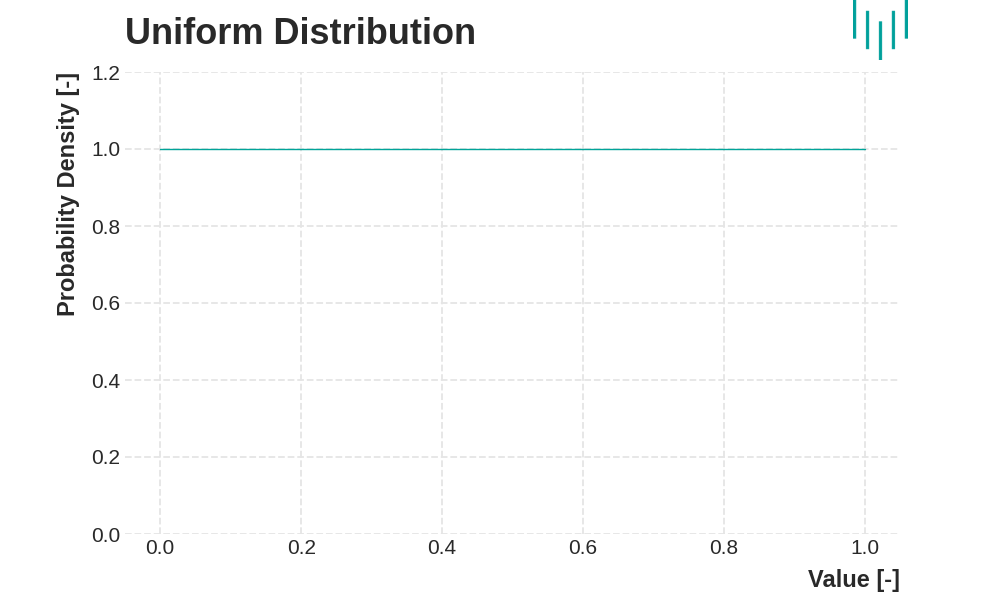
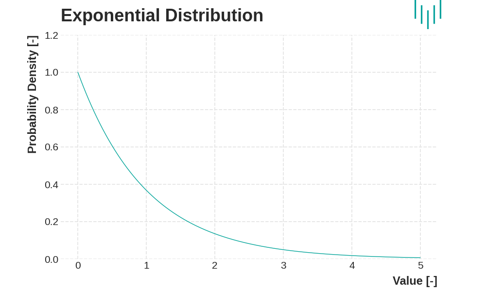

# Exercise 02 – Random variables, the Poisson process, and queueing systems

This exercise introduces the probabilistic tools used to describe network traffic. It reviews random variables and the uniform, exponential, and normal distributions, introduces the Poisson process as a baseline model of independent arrivals, and presents the M/M/1 queue together with Little's law. In the practical part, students generate random samples, build a discrete-event simulation of packet sources, a switch, and sinks in SimPy, and compare the measured delay and occupancy of a simulated M/M/1 system with the analytical formulas.

## Learning objectives

- Distinguish discrete and continuous random variables and read a probability mass or density function.
- Generate samples from the uniform, exponential, and normal distributions and interpret their histograms.
- State the assumptions of the Poisson arrival model and relate it to exponential inter-arrival times.
- Read Kendall notation and state the assumptions of the M/M/1 model.
- Compute offered traffic, utilization, mean occupancy, and mean delay of an M/M/1 system and verify them by simulation.

## Knowledge prerequisites

Students should be able to:

- Calculate an arithmetic mean, interpret a graph, and recall Gaussian noise and standard deviation from [Exercise 01](../qos-01/README.md).
- Convert packet sizes from bytes to bits and calculate a transmission time from a packet size and a bit rate.
- Write Python functions, pass arguments to them, and access an object's attributes and methods.

Random variables and probability distributions are reviewed below. The Poisson process, queueing models, and simulation with SimPy are introduced in this exercise.

## Theory

### Random variables

A *random variable* assigns a number to the outcome of a random experiment. It is *discrete* when it takes finitely or countably many values (the number of packets arriving in one second) and *continuous* when it takes any value in an interval (the time between two arrivals).

The behavior of a random variable $X$ is described by its *probability distribution*: a probability mass function (PMF) $P(X = k)$ for discrete variables, or a probability density function (PDF) $f(x)$ for continuous ones, where the probability of $X$ falling into an interval is the area under $f$ over that interval. Two numbers summarize a distribution:

- the *expectation* (mean) $E[X]$, the value around which outcomes are centered, and
- the *variance* $\operatorname{Var}[X] = E\big[(X - E[X])^2\big]$, the spread of outcomes around the mean; its square root is the standard deviation $\sigma$.

### Uniform distribution

The continuous uniform distribution on the interval $[a, b]$ assigns equal density to every value in the interval:

$$
f(x) = \frac{1}{b - a}, \qquad a \leq x \leq b
$$

where $a$ and $b$ are the interval bounds; the mean is $(a + b)/2$. Pseudo-random generators produce uniform samples on $[0, 1)$, from which samples of every other distribution are derived.



### Exponential distribution

The exponential distribution describes the waiting time until the next event of a Poisson process, or equivalently the interval between two consecutive events:

$$
f(x) = \lambda e^{-\lambda x}, \qquad x \geq 0
$$

where $\lambda$ is the event rate [s⁻¹] and $1/\lambda$ the mean waiting time [s]. The distribution is *memoryless*: the time still to wait does not depend on how long one has already waited. This property is what makes the queueing models below tractable.



### Normal distribution

The normal distribution, introduced in [Exercise 01](../qos-01/README.md#gaussian-noise), can approximate quantities arising from many small independent effects, such as measurement errors and channel noise. It is described by its mean $\mu$ and standard deviation $\sigma$. It is useful for comparing distribution shapes, but permits negative values and therefore cannot directly model inter-arrival times. The simulation below uses positive uniform intervals as a contrasting model that is not memoryless.

### Poisson process

A homogeneous Poisson process is a baseline model of arrivals at a constant average rate $\lambda$. Counts in disjoint time intervals are independent, and the distribution of a count depends only on the interval length. These assumptions can approximate some aggregated traffic, but do not describe every packet stream: periodic transmissions and correlated bursts violate them. The process has two equivalent descriptions. First, the number of arrivals $N$ in an interval of length $t$ has the Poisson distribution

$$
P(N = k) = \frac{(\lambda t)^k}{k!} \, e^{-\lambda t}, \qquad k = 0, 1, 2, \dots
$$

where $\lambda$ is the arrival rate [s⁻¹] and $t$ the interval length [s]; the mean number of arrivals is $\lambda t$. Second, the intervals between consecutive arrivals are independent and exponentially distributed with rate $\lambda$.

The second description is the one used in simulation: a source that draws each inter-arrival time from an exponential distribution generates a Poisson process.

### Queueing systems

A *queueing system* serves incoming *requests* (customers, calls, packets) using one or more *service channels* (servers, lines). The number of servers determines how many requests can be served simultaneously. The buffer capacity limits waiting requests, whereas total system capacity includes requests in service. In the simulation, buffer capacity is specified in bytes. A request that finds a free channel is served immediately; otherwise it either waits in a *queue* (a router buffer) or is rejected (a PBX without call waiting). A system is characterized by

- the input flow – how requests arrive,
- the service – the number of channels and the distribution of service times, and
- the queueing discipline – how waiting requests are managed (queue length, service order).

*Kendall notation* $A/B/n$ summarizes these: $A$ is the arrival process, $B$ the service-time distribution, and $n$ the number of channels. The symbol M (*Markovian*) denotes a Poisson process for $A$ and an exponential distribution for $B$; D denotes deterministic times and G a general distribution.

### The M/M/1 system

M/M/1 is the simplest queueing model: Poisson arrivals with rate $\lambda$, exponentially distributed service times with rate $\mu$ (mean service time $S = 1/\mu$), one channel, an unbounded queue, and first-in-first-out service. A constant-rate switch port with Poisson arrivals and exponentially distributed packet sizes approximates this model when its buffer is large enough that loss is negligible. A finite buffer and the rounding of packet sizes in the simulation make the correspondence approximate.

The *offered traffic* (traffic intensity) is

$$
A = \lambda S = \frac{\lambda}{\mu}
$$

where $A$ is the offered traffic [erl], $\lambda$ the arrival rate [s⁻¹], $S$ the mean service time [s], and $\mu$ the service rate [s⁻¹]. For a stable single-server system without losses, the *utilization* $\rho$, the fraction of time the server is busy, equals the offered traffic:

$$
\rho = \frac{\lambda}{\mu} = A
$$

The infinite-buffer model has a steady state only for $\rho < 1$. At or above this threshold there is no finite steady-state mean queue length. In a finite-buffer simulation, excess traffic is dropped instead of accumulating indefinitely.

> [!IMPORTANT]
> With $k$ channels (M/M/k) the utilization is $\rho = A/k$; the remaining formulas of this section hold for M/M/1 only.

For a stable M/M/1 system the mean number of requests in the system $L$ and in the queue $L_q$ are

$$
L = \frac{\rho}{1 - \rho}, \qquad L_q = L - \rho = \frac{\rho^2}{1 - \rho}
$$

and the mean time a request spends in the system $W$ and in the queue $W_q$ are

$$
W = \frac{1}{\mu - \lambda}, \qquad W_q = W - \frac{1}{\mu} = \frac{\rho}{\mu - \lambda}
$$

where $L$ and $L_q$ are dimensionless [–] and $W$ and $W_q$ are times [s]. All four quantities grow without bound as $\rho \to 1$, which is why links are operated well below full utilization.

### Worked example: from packet size to delay

Consider Poisson arrivals at $\lambda = 5$ packets/s, exponential packet sizes with mean $\bar{b} = 100$ B, and a link rate $R = 8000$ bit/s. The mean service time is

$$
S = \frac{8\bar{b}}{R} = \frac{8 \cdot 100}{8000} = 0.1 \; \mathrm{s}
$$

where $S$ is mean service time [s], $\bar{b}$ is mean packet size [B], and $R$ is link rate [bit/s]. Thus $\mu = 10$ packets/s and $\rho = 0.5$. For the ideal M/M/1 model, $L = 1$, $W = 0.2$ s, and $W_q = 0.1$ s. The packet spends 0.1 s waiting and 0.1 s being transmitted, on average.

```text
Source → [ waiting queue → server ] → Sink
           time W_q       service
           └──── time in system W ─┘
```

The queue occupancy $L_q$ excludes the packet being transmitted; system occupancy $L$ includes it.

### Little's law

Little's law relates occupancy and delay for *any* stable queueing system, regardless of the arrival and service distributions:

$$
L = \lambda W, \qquad L_q = \lambda W_q
$$

where $L$ is the mean number of requests in the system [–], $\lambda$ the rate of requests admitted to that system [s⁻¹], and $W$ their mean time in the system [s]; the second form applies to the queue alone. If requests are rejected, use the admitted rate rather than the offered rate. The law allows one of the three quantities to be obtained from measurements of the other two; in the simulation, the mean occupancy reported by a network tap and the mean delay reported by a sink should satisfy it.

## Exercise

### Preparation

Create the environment and start JupyterLab as described in the [root README](../README.md), then open `qos_02/exercise_02.ipynb`.

```bash
cd qos-02
uv sync
uv run jupyter lab --ip 0.0.0.0
```

The simulation uses [SimPy](https://simpy.readthedocs.io/) to advance from one event to the next. One simulation time unit (STU) represents one second in this exercise. The components in `lib/core.py` have the following roles:

| Component | Role |
|---|---|
| `PacketSource` | Generates packets with specified sizes and inter-arrival times |
| `SwitchPort` | Buffers waiting packets and transmits one packet at a fixed bit rate |
| `Switch` | Groups several ports |
| `PacketSink` | Records the elapsed time from packet creation to reception |
| `NetworkTap` | Samples system occupancy in packets, including a packet in service; byte counts cover the waiting queue only |
| `PacketFork` | Sends each packet to one of several destinations with given probabilities |

Connect components through their `destination` attributes. Sizes and intervals may be numbers or functions called without arguments. For example, `partial(rng.exponential, 2)` provides a function that generates an exponential interval with mean 2 s each time it is called.

### Preparation – Generate random samples

Run the notebook's theory cells to draw 10 000 samples from each distribution and plot normalized histograms. Record the seed, parameters, sample mean, and standard deviation. Compare the histogram with the theoretical density. A finite-sample minimum or maximum is not a distribution boundary for an unbounded distribution.

The following step numbers match the notebook.

### Step 1 – Source and sink

Run one `PacketSource` connected directly to a `PacketSink`. Extend this to two sources with different sizes and intervals, then replace constants by distributions using `partial`. Compare the timing in the sink log with the source settings.

### Step 2 – Source, switch, and sink

Insert a `Switch` between source and sink. Use uniform intervals from 1 to 3 s, exponential packet sizes with mean 50 B, a 100 B buffer, and a rate of 1000 bit/s. Calculate the transmission time of one packet and compare it with the sink's elapsed time. Record the drop counter, then reduce the rate or buffer capacity and explain the effect.

### Step 3 – Network tap

Attach a `NetworkTap` to the port from Step 2. Compare its packet counts with the sink delays. Identify which count includes service and which counts only the waiting queue before applying a queueing formula.

### Step 4 – M/M/1 approximation

Use exponential intervals with mean 2 s, exponential packet sizes with mean 100 B, one port at 1000 bit/s, and a 10 000 B buffer. Run for 8000 s and exclude the first 1000 s as a warm-up period, during which an initially empty system approaches typical operating conditions. The notebook dashboard uses measurements after this cutoff.

Compute $\lambda$, $\mu$, $\rho$, $L$, $W$, and $W_q$ from the parameters. Compare $L$ with the tap's mean packet count and $W$ with the sink's mean time in system. Check Little's law, and report the drop count as well as delay.

Repeat with three recorded seeds, recreating the simulation each time. Tabulate the results and their variation. Increase the arrival rate towards $\rho = 1$ and explain why finite-buffer loss and longer transients can weaken agreement with the ideal model. A longer run reduces sampling variation but does not remove differences in model assumptions.

### Step 5 – A network of queues (extension)

Run the final simulation with three sources, two forks, and four switch ports. Identify the offered traffic on each port and explain the differences between the delays at the two sinks.

### Results to retain

Save the completed notebook, a distribution comparison plot, and a table of theoretical and measured queue metrics for each seed. State the units, observation period, drop counts, and whether each measurement describes the queue or the whole system. Explain the main discrepancies in a short paragraph.

## Questions

1. Fifteen customers per hour arrive at a payphone according to a Poisson process, and a call lasts on average 3 minutes with an exponential distribution. Is a second payphone needed if the mean waiting time is not to exceed 3 minutes?
2. In Step 4, what are $\lambda$, $\mu$, and $\rho$, and which formula should the measured mean time in system match: $W$ or $W_q$?
3. What does Little's law predict for the mean occupancy in Step 4, and does the network tap confirm it?
4. Why does the mean delay of an M/M/1 system increase sharply as $\rho$ approaches 1, even though the server is still not saturated?
5. Which of the three distributions in the preparation is memoryless, and why does that matter for the choice of a traffic model?

## References

1. L. Kleinrock, *Queueing Systems, Volume I: Theory*. Wiley, 1975.
2. D. Gross, J. F. Shortle, J. M. Thompson, and C. M. Harris, *Fundamentals of Queueing Theory*, 4th ed. Wiley, 2008.
3. J. D. C. Little, "A Proof for the Queuing Formula: L = λW," *Operations Research*, vol. 9, no. 3, pp. 383–387, 1961.
4. G. Bernstein, "Discrete Event Simulation in Python," Grotto Networking, https://www.grotto-networking.com/DiscreteEventPython.html — origin of the simulation components used in this exercise.
5. SimPy documentation, https://simpy.readthedocs.io/.
