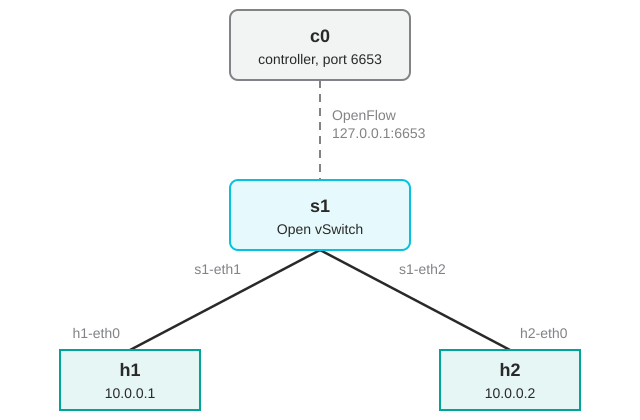
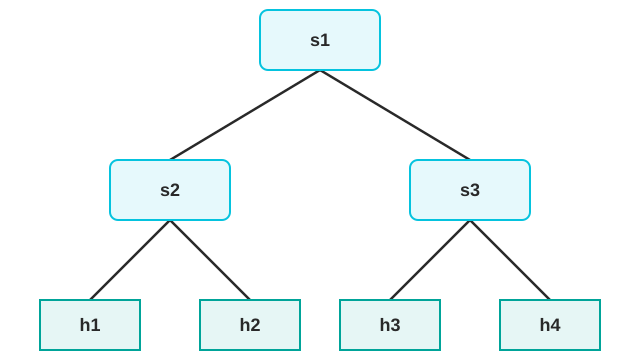
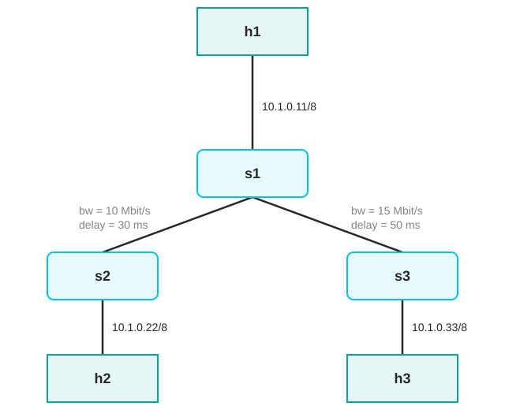

# Exercise 05 – Software-defined network emulation in Mininet

This exercise introduces Mininet, an emulator that runs a complete network of hosts, switches, and links on a single Linux machine, and uses it to look inside a software-defined network. Students start Mininet with built-in topologies, treat the emulated hosts as ordinary Linux machines, read and modify the OpenFlow flow table of an Open vSwitch instance, measure link performance with iperf, and finally define their own topology with bandwidth, delay, and loss on the links. The exercise runs entirely in the Mininet command line on the laboratory servers; no notebook is used.

## Learning objectives

- Explain how Mininet emulates hosts, switches, and links, and what limits its fidelity.
- Start, inspect, and clean up Mininet networks with the `mn` command and the Mininet CLI.
- Describe the roles of the controller and the switch in OpenFlow and read a flow-table entry.
- Delete and add flow entries by hand and predict the effect on connectivity.
- Measure throughput, delay, and loss between emulated hosts with iperf and ping.
- Write a custom topology in Python with traffic-control parameters on its links.

## Knowledge prerequisites

Students should be able to:

- Distinguish a host, a switch, and a router, and explain the purpose of Ethernet MAC addresses and IP addresses.
- Describe the basic roles of TCP and UDP, and interpret throughput, delay, and packet loss using [Exercise 03](../qos-03/README.md).
- Navigate directories, run Linux commands, and recognize the purpose of `sudo` and `ping`.
- Read a simple Python class definition and identify its constructor and method calls.

Mininet, software-defined networking, and OpenFlow are introduced in this exercise. The supplied Python template provides the structure for defining a custom topology.

## Theory

### Mininet

Mininet builds a network from standard Linux components. Each emulated *host* is a process in its own network namespace, so it has its own interfaces, routing table, and network stack and can run Linux programs; a host is not a virtual machine. By default, hosts share the server filesystem and process-ID namespace. *Switches* are instances of Open vSwitch (OVS), a software switch that speaks OpenFlow. *Links* are pairs of virtual Ethernet interfaces (`veth`), optionally shaped by the Linux traffic-control subsystem to emulate bandwidth, delay, and loss. All of this shares one kernel, which makes networks of dozens of nodes start in seconds, but also means that the emulated links are only as fast as the machine's CPU allows and that timing is less precise than on real hardware.

Mininet is driven either through its Python API or through the `mn` wrapper, which creates a topology from command-line options and drops into an interactive CLI. In the CLI, a command prefixed with a host name is executed on that host (`h1 ping h2`); other commands (`nodes`, `net`, `dump`, `dpctl`, `iperf`) act on the whole network.

### Software-defined networking and OpenFlow

In a conventional switch, the *control plane* (deciding where a frame goes) and the *data plane* (forwarding it) are in the same box. Software-defined networking (SDN) separates them: a *controller* computes forwarding decisions and installs them into the switches as *flow entries* through a protocol such as OpenFlow, and the switch merely matches packets against its *flow table* and applies the associated actions.

A flow entry consists of *match fields* (ingress port, MAC and IP addresses, protocol, ports, and others), a *priority*, *actions* (output to a port, send to the controller, drop, rewrite a header field), *counters*, and *timeouts*. A packet that matches no entry causes a *table miss*. Its treatment depends on the OpenFlow version and table configuration. OpenFlow 1.0 sends unmatched packets from the last table to the controller; in OpenFlow 1.3, a table without a matching entry or a table-miss entry drops them. A learning controller can install forwarding rules after observing traffic. Match fields and timeouts depend on the controller. A nonzero `idle_timeout` expires an entry after that many seconds without a matching packet; zero disables idle expiry. See the [Open vSwitch manual](https://www.openvswitch.org/support/dist-docs/ovs-ofctl.8.html).

Controller-free MAC learning requires bridge/standalone mode: use `--switch ovsbr --controller=none`. Removing the controller alone does not enable learning for an `OVSSwitch` in secure mode. Secure mode is useful for observing only the forwarding rules installed explicitly. See the [Mininet switch definitions](https://github.com/mininet/mininet/blob/master/mininet/node.py).

### Link emulation

The `tc` link type applies the mechanisms of [Exercise 03](../qos-03/README.md#traffic-control-in-linux) to every link automatically: an `htb` qdisc limits the bandwidth (`bw`, in Mbit/s) and a `netem` qdisc adds the delay (`delay`) and independent random loss (`loss`, in percent). Parameters apply per direction on the interface at each end of the link, so a `delay="30ms"` link adds 30 ms each way and 60 ms to the round-trip time.

## Exercise

### Preparation

Log in to a laboratory server over SSH with the address and credentials distributed through the LMS. Mininet requires root privileges; the servers are prepared so that `sudo` works for the laboratory user. Steps 1–3 and the first part of Step 5 require an installed learning controller compatible with OpenFlow 1.0. Mininet selects an available controller; its name `c0` does not identify a particular implementation. The later manual-rule experiment uses OpenFlow 1.3 without a controller.

```bash
ssh student@SERVER
```

If a previous session crashed or was not exited, clean up before starting:

```bash
sudo mn -c
```

If the configured controller port is already in use, identify the process. Stop it only if it belongs to the previous session for this experiment; shared laboratory services may use the same port. Substitute the port reported by the controller configuration:

```bash
sudo lsof -i :PORT
```

In the following, commands prefixed with `mininet>` are entered in the Mininet CLI; all others are entered in the server shell. The CLI command `sh` runs a command in the server namespace. Exit the current Mininet session before starting another topology. Record `mn --version`, `ovs-ofctl --version`, and `iperf --version`; the examples use iperf 2, whose options differ from iperf3.

### Step 1 – A single-switch topology

Start one switch with two hosts, explicitly selecting OpenFlow 1.0 for this controller-based example. A compatible learning controller must be available on the server:

```bash
sudo mn --topo single,2 --switch ovsk,protocols=OpenFlow10
```



Mininet reports what it builds. The following output is illustrative; version strings, addresses, and counters can differ:

```text
*** Creating network
*** Adding controller
*** Adding hosts:
h1 h2
*** Adding switches:
s1
*** Adding links:
(h1, s1) (h2, s1)
*** Configuring hosts
h1 h2
*** Starting controller
c0
*** Starting 1 switches
s1 ...
*** Starting CLI:
```

The names `h1`, `h2`, `s1`, and `c0` identify the nodes. Record the selected controller executable, allowed protocol, and controller address, then check connectivity and leave the CLI:

```bash
mininet> py net.controllers[0].command
mininet> sh ovs-vsctl get Bridge s1 protocols
mininet> sh ovs-vsctl get-controller s1
mininet> h1 ping -c 3 h2
mininet> exit
```

### Step 2 – Hosts as Linux machines

A command prefixed with a host name runs on that host. Repeat the launch command from Step 1 and inspect the interfaces of `h1`:

```bash
mininet> h1 ip a
```

```text
1: lo: <LOOPBACK,UP,LOWER_UP> mtu 65536 qdisc noqueue state UNKNOWN group default qlen 1000
    inet 127.0.0.1/8 scope host lo
2: h1-eth0@if11: <BROADCAST,MULTICAST,UP,LOWER_UP> mtu 1500 qdisc noqueue state UP group default qlen 1000
    link/ether ea:21:6a:29:c0:5e brd ff:ff:ff:ff:ff:ff link-netnsid 0
    inet 10.0.0.1/8 brd 10.255.255.255 scope global h1-eth0
```

The host has its own interface `h1-eth0` with a MAC and an IP address. For longer work on a host, open a shell in its namespace; `exit` returns to the Mininet CLI:

```bash
mininet> h1 bash
```

Programs such as `tcpdump`, `iperf`, or a web server use the host network namespace. Their timing and resource availability still depend on the shared emulation server.

### Step 3 – Inspect the network

Three CLI commands describe the running network. Run each and relate its output to the figure in Step 1.

```bash
mininet> nodes
mininet> net
mininet> dump
```

`nodes` lists the node names, `net` the links between them interface by interface, and `dump` the type, addresses, and process ID of every node.

### Step 4 – A tree topology without a controller

`mn` builds several standard topologies (`man mn`). Exit the previous session, then start a two-level tree with two children per node in bridge mode:

```bash
sudo mn --topo tree,depth=2,fanout=2 --switch ovsbr --controller=none
```



The explicit bridge mode makes the switches learn MAC addresses locally. Verify with `pingall` that every host reaches every other, then compare the output of `net` with the figure.

### Step 5 – The switch and its flow table

Exit the tree topology and repeat the launch command from Step 1. For an OVS switch, Mininet's `dpctl` command wraps `ovs-ofctl` and runs it against each switch. Inspect the software, port numbers, counters, and flow table:

```bash
mininet> dpctl dump-desc
mininet> dpctl show
mininet> dpctl dump-ports
mininet> dpctl dump-flows
mininet> h1 ping -c 3 h2
mininet> dpctl dump-flows
```

Compare the tables before and after the ping. For each new entry, identify match fields, priority, output action, packet counter, and any timeout. The controller may use broad forwarding rules rather than one rule per IP flow. An explicit `actions=CONTROLLER` rule is also not required for OpenFlow 1.0's unmatched-packet behavior.

`dpctl dump-tables` reports table statistics. `dpctl ping` sends OpenFlow echo requests from the command-line tool to the switch; it does not measure the controller-to-switch connection or host-to-host delay. To inspect controller traffic, capture the actual TCP port reported by `ovs-vsctl get-controller s1`. Local `ovs-ofctl` requests usually use a Unix socket and will not appear in that TCP capture.

For a reproducible manual-forwarding experiment, exit this session and start a secure-mode switch with OpenFlow 1.3 and no controller:

```bash
sudo mn --topo single,2 --mac --switch ovsk,protocols=OpenFlow13,failMode=secure --controller=none
```

Use `ovs-ofctl` with the same explicit protocol version. Clear the table and inspect the port numbers before testing connectivity:

```bash
mininet> sh ovs-ofctl -O OpenFlow13 del-flows s1
mininet> sh ovs-ofctl -O OpenFlow13 show s1
mininet> sh ovs-ofctl -O OpenFlow13 dump-flows s1
mininet> h1 ping -c 3 h2
```

With no matching forwarding rule, no controller, and no standalone learning, this ping should fail. Explain why a running OpenFlow 1.0 learning controller could instead reinstall entries after a table is cleared.

For the two-host topology, `show` should identify `s1-eth1` as port 1 and `s1-eth2` as port 2. Use the observed port numbers to install bidirectional forwarding:

```bash
mininet> sh ovs-ofctl -O OpenFlow13 add-flow s1 'priority=100,in_port=1,actions=output:2'
mininet> sh ovs-ofctl -O OpenFlow13 add-flow s1 'priority=100,in_port=2,actions=output:1'
mininet> h1 ping -c 3 h2
mininet> sh ovs-ofctl -O OpenFlow13 dump-flows s1
```

These entries forward all frames between the two ports, including address resolution traffic. They are sufficient for this two-host topology but do not provide general switching between additional ports. Compare their scope and counters with the controller-installed rules observed earlier. Keep this working topology for Step 6.

### Step 6 – Performance testing with iperf

iperf measures the throughput between two hosts; one runs the server, the other the client. The Mininet CLI also offers a shortcut, `iperf h1 h2`, that does both.

```bash
mininet> h1 iperf -s &
mininet> h2 iperf -c h1
```

Read the achieved TCP throughput. A virtual port may advertise `10GB-FD`, but that value is not a measured capacity or a guarantee of 10 Gbit/s. Throughput can be limited by CPU scheduling, protocol processing, and TCP behavior. Later compare it with the explicitly configured link rates. This test alone does not measure one-way delay or the original packet-loss rate; retransmissions can conceal losses from the application while reducing throughput.

### Step 7 – A custom topology with link parameters

Built-in topology options cover common structures and can set shared link parameters. A custom topology allows arbitrary connections and different parameters on individual links. A custom topology is a Python class derived from `mininet.topo.Topo` that adds hosts, switches, and links in its constructor, registered in a `topos` dictionary so that `mn` can find it by name:

```python
from mininet.topo import Topo


class MyTopo(Topo):
    def __init__(self):
        Topo.__init__(self)

        # Hosts and switches
        # ...

        # Links
        # ...


topos = {"mytopo": lambda: MyTopo()}
```

The topology to build is shown below: three switches in a tree, one host on each, and bandwidth and delay on the inter-switch links.



Hosts are added with an explicit address, switches with a name only:

```python
h1 = self.addHost("h1", ip="10.1.0.11/8")
h2 = self.addHost("h2", ip="10.1.0.22/8")
h3 = self.addHost("h3", ip="10.1.0.33/8")

s1 = self.addSwitch("s1")
s2 = self.addSwitch("s2")
s3 = self.addSwitch("s3")
```

Links connect two nodes and accept traffic-control parameters: `bw` in Mbit/s, `delay` as a string with a unit, and `loss` in percent:

```python
self.addLink(h1, s1)
self.addLink(h2, s2)
self.addLink(h3, s3)

self.addLink(s1, s2, bw=10, delay="30ms")
self.addLink(s1, s3, bw=15, delay="50ms")
```

The complete file is provided as [`mytopo.py`](mytopo.py). Exit the current session and work in the repository's `qos-05/` directory on the server. Select `tc` links to apply their bandwidth, delay, and loss parameters, and bridge mode so this performance experiment does not depend on a controller:

```bash
sudo mn --custom mytopo.py --topo mytopo --mac --link tc --switch ovsbr --controller=none
```

Verify the structure with `net`. Before running ping, predict the round-trip times: `h1`–`h2` traverses a 30 ms link in each direction, giving a 60 ms delay contribution; `h2`–`h3` traverses both inter-switch links, giving $2(30+50)=160$ ms. Processing, transmission, and queueing can add to these values. Measure both paths and explain the differences.

### Step 8 – Loss and delay

`mytopo.py` also registers `mytopo_lossy`, with independent 2 % loss per direction on both inter-switch links. Exit the previous session and launch it from the same directory:

```bash
sudo mn --custom mytopo.py --topo mytopo_lossy --mac --link tc --switch ovsbr --controller=none
```

Measure with UDP iperf and ping. Read loss and jitter from the UDP receiver's report; these describe received datagrams and their arrival timing:

```bash
mininet> h2 iperf -s -u &
mininet> h1 iperf -c 10.1.0.22 -u -b 1M -t 10
mininet> h1 ping -c 20 10.1.0.22
```

```text
[ ID] Interval       Transfer     Bandwidth        Jitter   Lost/Total Datagrams
[  1] 0.0000-10.0134 sec  1.23 MBytes  1.03 Mbits/sec   0.098 ms 19/895 (2.1%)
```

```text
--- 10.1.0.22 ping statistics ---
20 packets transmitted, 19 received, 5% packet loss, time 19031ms
rtt min/avg/max/mdev = 60.146/60.868/62.597/1.001 ms
```

The output above is illustrative. UDP from `h1` to `h2` crosses one impaired link in one direction, so its expected loss is 2 %. A ping succeeds only if both request and reply survive. With independent losses, its failure probability is $1-(1-0.02)^2 = 3.96$ %. A 20-packet test can report only multiples of 5 %, and random variation may produce zero failures.

For a path crossing independent loss points, compute

$$
p_{\mathrm{loss}} = 1 - \prod_{i=1}^{k}(1-p_i)
$$

where $p_{\mathrm{loss}}$ is path loss probability [–], $p_i$ is the loss probability at point $i$ [–], and $k$ is the number of traversed loss points [–]. For ping, include both directions. Thus the `h2`–`h3` path with two 2 % links has expected one-way loss of 3.96 % and round-trip failure probability of about 7.76 %.

Edit the inter-switch links to use different loss rates, such as 2 % and 5 %, restart, and repeat. Measure both `h1`–`h2` and `h2`–`h3` so that the second path crosses both impaired links. Start a UDP server on the destination host for each test. State the direction, packet count, and complete path when comparing measured and configured loss.

## Questions

1. What is the difference between a Mininet host and a virtual machine, and which experiments would this difference invalidate?
2. In the controller-based experiment, when is a packet sent to the controller? How can an installed forwarding entry change the handling of later packets?
3. Why does the empty secure-mode OpenFlow 1.3 switch fail to forward packets? How do the two manual port rules restore connectivity, and why are they insufficient for a switch with more ports?
4. A link is defined with `delay="30ms"`. What delay contribution should it make to ping round-trip time, and what can make the measured value larger?
5. Why can a 20-packet ping report 5 % or 0 % loss on a link with 2 % loss per direction? Compare tests with 20, 200, and 2000 probes. Why would a formal sample-size requirement also need a confidence level and a definition of one-way or round-trip loss?
6. What does TCP iperf throughput measure? Why are additional measurements needed to distinguish a rate limit, delay, and packet loss?

## References

1. B. Lantz, B. Heller, and N. McKeown, "A Network in a Laptop: Rapid Prototyping for Software-Defined Networks," in *Proc. 9th ACM SIGCOMM Workshop on Hot Topics in Networks (HotNets-IX)*, 2010.
2. Mininet Project, *Mininet Walkthrough*, https://mininet.org/walkthrough/.
3. Open Networking Foundation, *OpenFlow Switch Specification*, version 1.3.5, 2015.
4. N. McKeown et al., "OpenFlow: Enabling Innovation in Campus Networks," *ACM SIGCOMM Computer Communication Review*, vol. 38, no. 2, pp. 69–74, 2008.
5. Open vSwitch documentation, https://docs.openvswitch.org/; `ovs-ofctl(8)` manual page.
6. iperf, https://iperf.fr/.
