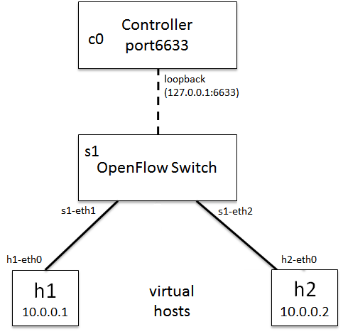
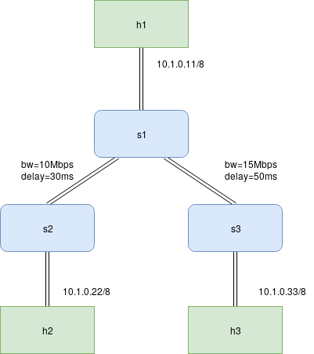

# Exercise 05 – Software-defined network emulation in Mininet

This exercise introduces Mininet, an emulator that runs a complete network of hosts, switches, and links on a single Linux machine, and uses it to look inside a software-defined network. Students start Mininet with built-in topologies, treat the emulated hosts as ordinary Linux machines, read and modify the OpenFlow flow table of an Open vSwitch instance, measure link performance with iperf, and finally define their own topology with bandwidth, delay, and loss on the links. The exercise runs entirely in the Mininet command line on the laboratory servers; no notebook is used.

## Learning objectives

- Explain how Mininet emulates hosts, switches, and links, and what limits its fidelity.
- Start, inspect, and clean up Mininet networks with the `mn` command and the Mininet CLI.
- Describe the roles of the controller and the switch in OpenFlow and read a flow-table entry.
- Delete and add flow entries by hand and predict the effect on connectivity.
- Measure throughput, delay, and loss between emulated hosts with iperf and ping.
- Write a custom topology in Python with traffic-control parameters on its links.

## Theory

### Mininet

Mininet builds a network from standard Linux components. Each emulated *host* is a process in its own network namespace, so it has its own interfaces, routing table, and processes and can run any Linux program; a host is not a virtual machine. *Switches* are instances of Open vSwitch (OVS), a software switch that speaks OpenFlow. *Links* are pairs of virtual Ethernet interfaces (`veth`), optionally shaped by the Linux traffic-control subsystem to emulate bandwidth, delay, and loss. All of this shares one kernel, which makes networks of dozens of nodes start in seconds, but also means that the emulated links are only as fast as the machine's CPU allows and that timing is less precise than on real hardware.

Mininet is driven either through its Python API or through the `mn` wrapper, which creates a topology from command-line options and drops into an interactive CLI. In the CLI, a command prefixed with a host name is executed on that host (`h1 ping h2`); other commands (`nodes`, `net`, `dump`, `dpctl`, `iperf`) act on the whole network.

### Software-defined networking and OpenFlow

In a conventional switch, the *control plane* (deciding where a frame goes) and the *data plane* (forwarding it) are in the same box. Software-defined networking (SDN) separates them: a *controller* computes forwarding decisions and installs them into the switches as *flow entries* through a protocol such as OpenFlow, and the switch merely matches packets against its *flow table* and applies the associated actions.

A flow entry consists of *match fields* (ingress port, MAC and IP addresses, protocol, ports, and others), a *priority*, *actions* (output to a port, send to the controller, drop, rewrite a header field), *counters*, and *timeouts*. A packet that matches no entry is a *table miss*; with the default Mininet controller it is sent to the controller, which acts as a learning switch: it decides where the packet should go and installs a specific flow entry so that subsequent packets of the same flow are forwarded by the switch alone. The entry expires when the flow is idle for `idle_timeout` seconds.

Started with `--controller=none`, the OVS switches have no controller and fall back to their built-in MAC-learning behavior, so the network behaves like a set of ordinary layer-2 switches.

### Link emulation

The `tc` link type applies the mechanisms of [Exercise 03](../qos-03/README.md#traffic-control-in-linux) to every link automatically: an `htb` qdisc limits the bandwidth (`bw`, in Mbit/s) and a `netem` qdisc adds the delay (`delay`) and independent random loss (`loss`, in percent). Parameters apply per direction on the interface at each end of the link, so a `delay="30ms"` link adds 30 ms each way and 60 ms to the round-trip time.

## Exercise

### Preparation

Log in to a laboratory server over SSH with the address and credentials distributed through the LMS. Mininet requires root privileges; the servers are prepared so that `sudo` works for the laboratory user.

```bash
ssh student@SERVER
```

If a previous session crashed or was not exited, clean up before starting:

```bash
sudo mn -c
```

If `mn` reports that the controller port is in use, find and terminate the process holding it:

```bash
sudo lsof -i :6653
sudo kill PID
```

In the following, commands prefixed with `mininet>` are entered in the Mininet CLI; all others in the server shell.

### Step 1 – The default topology

Start Mininet without arguments. The default topology is one switch with two hosts.

```bash
sudo mn
```



Mininet reports what it builds:

```text
*** Creating network
*** Adding controller
*** Adding hosts:
h1 h2
*** Adding switches:
s1
*** Adding links:
(h1, s1) (h2, s1)
*** Configuring hosts
h1 h2
*** Starting controller
c0
*** Starting 1 switches
s1 ...
*** Starting CLI:
```

The names `h1`, `h2`, `s1`, and `c0` identify the nodes in every later command. The controller `c0` is Mininet's built-in reference controller. Confirm connectivity, then leave the CLI:

```bash
mininet> h1 ping -c 3 h2
mininet> exit
```

### Step 2 – Hosts as Linux machines

A command prefixed with a host name runs on that host. Start Mininet again and inspect the interfaces of `h1`:

```bash
mininet> h1 ip a
```

```text
1: lo: <LOOPBACK,UP,LOWER_UP> mtu 65536 qdisc noqueue state UNKNOWN group default qlen 1000
    inet 127.0.0.1/8 scope host lo
2: h1-eth0@if11: <BROADCAST,MULTICAST,UP,LOWER_UP> mtu 1500 qdisc noqueue state UP group default qlen 1000
    link/ether ea:21:6a:29:c0:5e brd ff:ff:ff:ff:ff:ff link-netnsid 0
    inet 10.0.0.1/8 brd 10.255.255.255 scope global h1-eth0
```

The host has its own interface `h1-eth0` with a MAC and an IP address. For longer work on a host, open a shell in its namespace; `exit` returns to the Mininet CLI:

```bash
mininet> h1 bash
```

Programs such as `tcpdump`, `iperf`, or a web server run there exactly as on a physical machine.

### Step 3 – Inspect the network

Three CLI commands describe the running network. Run each and relate its output to the figure in Step 1.

```bash
mininet> nodes
mininet> net
mininet> dump
```

`nodes` lists the node names, `net` the links between them interface by interface, and `dump` the type, addresses, and process ID of every node.

### Step 4 – A tree topology without a controller

`mn` builds several standard topologies (`man mn`). Start a two-level tree with two children per node and no controller:

```bash
sudo mn --topo tree,depth=2,fanout=2 --controller=none
```

```text
        s1
     ___|___
    |       |
   s2       s3
  _|_      _|_
 |   |    |   |
h1  h2   h3  h4
```

Without a controller, the switches learn MAC addresses themselves. Verify with `pingall` that every host reaches every other, then compare the output of `net` with the drawing.

### Step 5 – The switch and its flow table

Return to the default topology (`sudo mn`). The `dpctl` CLI command sends OpenFlow requests to all switches; it is an alias of `ovs-ofctl`, which can be used from the server shell against a named switch (`ovs-ofctl dump-desc s1`).

Identify the switch software:

```bash
mininet> dpctl dump-desc
```

```text
*** s1 ------------------------------------------------------------------------
OFPST_DESC reply (xid=0x2):
Manufacturer: Nicira, Inc.
Hardware: Open vSwitch
Software: 2.10.1
```

List its ports and capabilities, and then the per-port counters:

```bash
mininet> dpctl show
mininet> dpctl dump-ports
```

```text
*** s1 ------------------------------------------------------------------------
OFPT_FEATURES_REPLY (xid=0x2): dpid:0000000000000001
n_tables:254, n_buffers:0
capabilities: FLOW_STATS TABLE_STATS PORT_STATS QUEUE_STATS ARP_MATCH_IP
actions: output enqueue set_vlan_vid set_vlan_pcp strip_vlan mod_dl_src mod_dl_dst ...
 1(s1-eth1): addr:26:98:6e:44:a0:70
     current:    10GB-FD COPPER
 2(s1-eth2): addr:2a:7d:0b:34:61:95
     current:    10GB-FD COPPER
```

```text
OFPST_PORT reply (xid=0x2): 3 ports
  port  "s1-eth1": rx pkts=13, bytes=1006, drop=0, errs=0, ...
           tx pkts=24, bytes=1852, drop=0, errs=0, coll=0
  port  "s1-eth2": rx pkts=12, bytes=936, drop=0, errs=0, ...
           tx pkts=25, bytes=1922, drop=0, errs=0, coll=0
```

These replies are OpenFlow messages; capturing on the server with `tcpdump -i lo port 6653` shows them on the wire. `dpctl dump-tables` summarizes the flow tables, including how many lookups and matches each table has seen, and `dpctl ping` measures the round-trip time of the OpenFlow channel to the controller.

Now read the flow table itself, first on an idle network:

```bash
mininet> dpctl dump-flows
```

```text
*** s1 ------------------------------------------------------------------------
 cookie=0x0, duration=2.572s, table=0, n_packets=10, n_bytes=852, priority=0 actions=CONTROLLER:128
```

The single entry is the table-miss rule: any packet, lowest priority, send the first 128 bytes to the controller. Generate traffic and read the table again:

```bash
mininet> h1 ping -c 3 h2
mininet> dpctl dump-flows
```

```text
 cookie=0x0, duration=2.422s, table=0, n_packets=1, n_bytes=98, idle_timeout=60, priority=1,icmp,in_port="s1-eth1",dl_src=5a:60:5b:e1:3d:38,dl_dst=1e:67:69:87:e2:39,nw_src=10.0.0.1,nw_dst=10.0.0.2,icmp_type=8 actions=output:"s1-eth2"
 cookie=0x0, duration=2.421s, table=0, n_packets=1, n_bytes=98, idle_timeout=60, priority=1,icmp,in_port="s1-eth2",dl_src=1e:67:69:87:e2:39,dl_dst=5a:60:5b:e1:3d:38,nw_src=10.0.0.2,nw_dst=10.0.0.1,icmp_type=0 actions=output:"s1-eth1"
 cookie=0x0, duration=1105.177s, table=0, n_packets=33, n_bytes=2462, priority=0 actions=CONTROLLER:128
```

The controller installed one entry per direction, matching the exact addresses and ICMP type of the flow, with an idle timeout of 60 s and a higher priority than the table-miss rule. Delete all entries and try the ping again:

```bash
mininet> dpctl del-flows
mininet> h1 ping -c 3 h2
```

#### Question

Why does the ping fail after the flow table has been emptied, although the controller is still running?

Install two entries by hand that forward everything between the two ports, and repeat the ping:

```bash
mininet> dpctl add-flow in_port=1,actions=output:2
mininet> dpctl add-flow in_port=2,actions=output:1
mininet> h1 ping -c 3 h2
mininet> dpctl dump-flows
```

Compare the entries and their counters with the ones the controller had installed.

### Step 6 – Performance testing with iperf

iperf measures the throughput between two hosts; one runs the server, the other the client. The Mininet CLI also offers a shortcut, `iperf h1 h2`, that does both.

```bash
mininet> h1 iperf -s &
mininet> h2 iperf -c h1
```

Read the reported bandwidth and compare it with the `10GB-FD` link speed reported by `dpctl show`; the difference is the cost of emulation.

### Step 7 – A custom topology with link parameters

Standard topologies cannot express arbitrary structures or link properties. A custom topology is a Python class derived from `mininet.topo.Topo` that adds hosts, switches, and links in its constructor, registered in a `topos` dictionary so that `mn` can find it by name:

```python
from mininet.topo import Topo


class MyTopo(Topo):
    def __init__(self):
        Topo.__init__(self)

        # Hosts and switches
        # ...

        # Links
        # ...


topos = {"mytopo": lambda: MyTopo()}
```

The topology to build is shown below: three switches in a tree, one host on each, and bandwidth and delay on the inter-switch links.



Hosts are added with an explicit address, switches with a name only:

```python
h1 = self.addHost("h1", ip="10.1.0.11/8")
h2 = self.addHost("h2", ip="10.1.0.22/8")
h3 = self.addHost("h3", ip="10.1.0.33/8")

s1 = self.addSwitch("s1")
s2 = self.addSwitch("s2")
s3 = self.addSwitch("s3")
```

Links connect two nodes and accept traffic-control parameters: `bw` in Mbit/s, `delay` as a string with a unit, and `loss` in percent:

```python
self.addLink(h1, s1)
self.addLink(h2, s2)
self.addLink(h3, s3)

self.addLink(s1, s2, bw=10, delay="30ms")
self.addLink(s1, s3, bw=15, delay="50ms")
```

The complete file is provided as [`mytopo.py`](mytopo.py); copy it to the server with `scp`. Start it with the `tc` link type, without which the link parameters are silently ignored, and with `--mac` so that the hosts receive readable MAC addresses:

```bash
sudo mn --custom mytopo.py --topo mytopo --mac --link tc
```

Verify the structure with `net`, then measure the round-trip time between `h1` and `h2` and between `h2` and `h3` with `ping` and explain both values from the link delays.

### Step 8 – Loss and delay

`mytopo.py` also registers `mytopo_lossy`, the same topology with 2 % loss on both inter-switch links. Start it and measure with UDP, which reports loss and jitter directly, and with ping:

```bash
mininet> h2 iperf -s -u &
mininet> h1 iperf -c 10.1.0.22 -u -b 1M -t 10
mininet> h1 ping -c 20 10.1.0.22
```

```text
[ ID] Interval       Transfer     Bandwidth        Jitter   Lost/Total Datagrams
[  1] 0.0000-10.0134 sec  1.23 MBytes  1.03 Mbits/sec   0.098 ms 19/895 (2.1%)
```

```text
--- 10.1.0.22 ping statistics ---
20 packets transmitted, 19 received, 5% packet loss, time 19031ms
rtt min/avg/max/mdev = 60.146/60.868/62.597/1.001 ms
```

Then edit the file to give the two links different loss rates (for example 2 % and 5 %), restart, and repeat the measurements towards `h2` and `h3`. Compare the measured loss with the configured value and explain the difference.

## Questions

1. What is the difference between a Mininet host and a virtual machine, and which experiments would this difference invalidate?
2. What happens in the switch and in the controller when the first packet of a new flow arrives, and what happens for the second packet?
3. After `dpctl del-flows`, why do the two hand-installed entries `in_port=1 → output:2` and `in_port=2 → output:1` restore connectivity, and what would they break in a network with more than two hosts?
4. A link is defined with `delay="30ms"`. What round-trip time does ping report across it, and why?
5. With 2 % loss configured on a link, why does a 20-packet ping report 5 % or 0 % loss, and how many packets are needed to measure the loss rate to within 0.5 percentage points?
6. Which of bandwidth, delay, and loss did the TCP iperf test of Step 6 reveal, and which would be hidden by TCP's behavior?

## References

1. B. Lantz, B. Heller, and N. McKeown, "A Network in a Laptop: Rapid Prototyping for Software-Defined Networks," in *Proc. 9th ACM SIGCOMM Workshop on Hot Topics in Networks (HotNets-IX)*, 2010.
2. Mininet Project, *Mininet Walkthrough*, https://mininet.org/walkthrough/.
3. Open Networking Foundation, *OpenFlow Switch Specification*, version 1.3.5, 2015.
4. N. McKeown et al., "OpenFlow: Enabling Innovation in Campus Networks," *ACM SIGCOMM Computer Communication Review*, vol. 38, no. 2, pp. 69–74, 2008.
5. Open vSwitch documentation, https://docs.openvswitch.org/; `ovs-ofctl(8)` manual page.
6. iperf, https://iperf.fr/.
